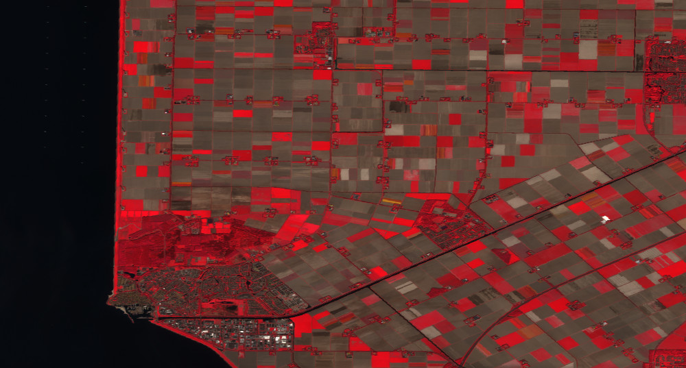

# OpenEO Cookbook

This is the openEO cookbook that you can refer to to get a first idea on how to solve problems with openEO in the three client languages Python, R and JavaScript. It describes how to implement simple use cases in a pragmatic way.

Please refer to the getting started guides for [JavaScript](../javascript/index.md), [Python](../python/index.md) and [R](../r/index.md) if you have never worked with one of the openEO client libraries before. This guide requires you to have a basic idea of how to establish a connection to a back-end and how to explore that back-end.

::: tip References
* [openEO processes documentation](../processes.md)
* [openEO Hub](https://hub.openeo.org) to discover back-ends with available data and processes
* [openEO Web Editor](https://editor.openeo.org) to visually build and execute processing workflows
_____________________
* [Python client documentation](https://open-eo.github.io/openeo-python-client/index.html)
* [JavaScript client documentation](https://open-eo.github.io/openeo-js-client/2.0.0/index.html)
* [R client documentation](https://open-eo.github.io/openeo-r-client/index.html)
:::

## Chapter 1

In this chapter, we want to explore the different output formats that are possible with openEO. For that, we load and filter a collection (a datacube) of satellite data and calculate the temporal mean of that data. Different steps (e.g. a linear scaling) are done to prepare for the data to be output in one of the formats: Raster or text data.

Throughout this guide, code examples for all three client languages are given. Select your preferred language with the code switcher on the right-hand side to set all examples to that language.

### Connecting to a back-end

Click the link below to see how to connect to a back-end (via OpenID Connect). You can call the connection object `con` as it is done in all following code, to avoid confusion throughout the rest of the tutorials.

<CodeSwitcher>
<template v-slot:py>

[Getting started: Authentication](../python/#openid-connect-authentication)

</template>

<template v-slot:r>

[Getting started: Authentication](../r/#openid-connect-authentication)

</template>

<template v-slot:js>

[Getting started: Authentication](../javascript/#openid-connect-authentication)

</template>

</CodeSwitcher>

In R and JavaScript it is very useful to assign a graph-building helper object to a variable, to easily access all openEO processes and add them to the process graph that you will be building. These objects will be used throughout this guide. In Python, it also helps to import a helper object, even though we'll need it less often.

<CodeSwitcher>
<template v-slot:py>

```python
# import ProcessBuilder functions
from openeo.processes import ProcessBuilder
```

**Note:** Many functions in _child processes_ (see below), are instances of this `ProcessBuilder` import.

</template>
<template v-slot:r>

```r
# assign the graph-building helper object to "p" for easy access to all openEO processes, see > ?processes()
p <- processes()
```

**Note:** In all R code, `p` is used to select openEO processes.

</template>
<template v-slot:js>

```js
// assign the graph-building helper object to "builder" for easy access to all openEO processes
var builder = await con.buildProcess();
```

**Note:** In all JavaScript code, `builder` is used to select openEO processes.

</template>
</CodeSwitcher>

### Input: `load_collection`

Before loading a collection, we need to find out the exact name of a collection we want to use (back-end-specific, see references [at the top](#openeo-cookbook)). We assign the spatial and temporal extent to variables, so that we can re-use them on other collections we might want to load. Let's look for a Sentinel 2 (preprocessed level 2A preferably) collection and load the green, red and a near-infrared band (bands 3, 4 and 8).

:::tip Collection and Band Names
The names of collections and bands differ between back-ends. So always check the collection description for the correct names. The differences might be subtle, e.g. `B8` vs. `B08`.
:::

We'll name our collection very explicitly `cube_s2_b348` as to not get confused later on.

<CodeSwitcher>
<template v-slot:py>

```python
# make dictionary, containing bounding box
urk = {"west": 5.5661, "south": 52.6457, "east": 5.7298, "north": 52.7335}
# make list, containing the temporal interval
t = ["2021-04-26", "2021-04-30"]

# load first datacube
cube_s2_b348 = con.load_collection(
    "COPERNICUS/S2_SR",
    spatial_extent = urk,
    temporal_extent = t,
    bands = ["B3", "B4", "B8"]
)
```

</template>
<template v-slot:r>

```r
# create variables for loading collection
urk <- list(west = 5.5661, south = 52.6457, east = 5.7298, north = 52.7335)

t <- c("2021-04-26", "2021-04-30")

# load first datacube
cube_s2_b348 <- p$load_collection(
  id = "COPERNICUS/S2_SR",
  spatial_extent = urk,
  temporal_extent = t,
  bands=c("B3", "B4", "B8")
)
```

</template>
<template v-slot:js>

```js
// make spatial and temporal extent
let urk = {"west": 5.5661, "south": 52.6457, "east": 5.7298, "north": 52.7335};

let t = ["2021-04-26", "2021-04-30"];   

// load first cube
var cube_s2_b348 = builder.load_collection(
    "COPERNICUS/S2_SR",
    urk,
    t,
    ["B3", "B4", "B8"]
);
```

**Note:** JavaScript doesn't use parameter names (like Python and R), so the parameters need to be in the order that they are defined in the [openEO processes documentation](../processes.md).

</template>
</CodeSwitcher>

### Filter Bands: `filter_bands`

To go through the desired output formats, we'll need one collection with three bands, and one collection with only one band. Here we use `filter_bands`, when of course we could also just define a separate collection via `load_collection`. As our input datacube already has the required three bands, we filter it for a single band to create an additional datacube with the same spatial and temporal extent, but with only one band (band 8). 

We'll name this one `cube_s2_b8` to distinguish it from the original `cube_s2_b348`.

<CodeSwitcher>
<template v-slot:py>

```python
# filter for band 8
cube_s2_b8 = cube_s2_b348.filter_bands(bands = ["B8"])
```

</template>
<template v-slot:r>

```r
# filter for band 8
cube_s2_b8 <- p$filter_bands(data = cube_s2_b348, bands = c("B8"))
```

</template>
<template v-slot:js>

```js
// filter for band 8
var cube_s2_b8 = builder.filter_bands(cube_s2_b348, ["B08"])
```

</template>
</CodeSwitcher>

### Temporal Mean: `reduce_dimension`

As we don't want to download the raw collection of satellite data, we need to reduce that data somehow. That means, we want to get rid of one dimension. Let's say we calculate a `mean` over all timesteps, and then drop the temporal dimension (as it's empty then anyway, see explanation in the [datacube guide](../datacubes.md#reduce)). This can be done via `reduce_dimension()`. The function requires a reducer, in our case a `mean` process, and the dimension over which to reduce, given as a string (`"t"`). 

:::tip Child Processes
Here, we need to define a child process: A function that is called by (or passed to) another function, and then works on a subset of the datacube (somewhat similar to the concept of callbacks in JavaScript). In this case: We want `reduce_dimension` to use the `mean` function to average all timesteps of each pixel. Not any function can be used like this, it must be defined by openEO, of course.

All clients have more or less different specifics when defining a child process. As you can observe directly below, one way to define one is to define the function directly inside the parent process.

For a more clean way to define a child process, see the chapter below.
:::

<CodeSwitcher>
<template v-slot:py>

```python
# reduce all timesteps
# mean_time() is a shortcut function
cube_s2_b8_red = cube_s2_b8.mean_time()

# alternatively, 'reduce_dimension' can be used
cube_s2_b8_red = cube_s2_b8.reduce_dimension(dimension="t", reducer="mean")

# additionally, reduce second collection
cube_s2_b348_red = cube_s2_b348.mean_time()
```

**Note:** In python, the child process can be a string.

</template>
<template v-slot:r>

```r
# reduce dimension, first collection
cube_s2_b8_red <- p$reduce_dimension(data = cube_s2_b8, reducer = function(data, context) { p$mean(data) }, dimension = "t")

# reduce, second collection
cube_s2_b348_red <- p$reduce_dimension(data = cube_s2_b348, reducer = function(data, context) { p$mean(data) }, dimension = "t")
```

**Note:** In R, we can select a child process from the `p` helper object.

</template>
<template v-slot:js>

```js
// reduce dimension
var cube_s2_b8_red = builder.reduce_dimension(cube_s2_b8, (data, _, child) => child.mean(data), "t");

// second collection
var cube_s2_b348_red = builder.reduce_dimension(cube_s2_b348, (data, _, child) => child.mean(data), "t");
```

**Note:** In JavaScript, arrow functions can be used as child processes.

</template>
</CodeSwitcher>

### Scale All Pixels Linearly: `apply`, `linear_scale_range`

To create a PNG output, we need to scale the satellite data we have down to the 8bit range of a PNG image. For this, the scale range of our imagery has to be known. For Sentinel 2 over urban and agricultural areas, we can use `6000` as a maximum.

We'll use the process `linear_scale_range`. It takes a number and the four borders of the intervals as input. Because it works on a number and not a datacube as all processes discussed so far, we need to nest the process into an `apply`, once again defining a child process. `apply` applies a unary process to all pixels of a datacube.

This time we'll also define our child processes externally, as to not get confused in too much code nesting.

<CodeSwitcher>
<template v-slot:py>

```python
# define child process, use ProcessBuilder
def scale_function(x: ProcessBuilder):
    return x.linear_scale_range(0, 6000, 0, 255)

# apply scale_function to all pixels
cube_s2_b348_red_lin = cube_s2_b348_red.apply(scale_function)
```

**Resource:** Refer to the [Python client documentation](https://open-eo.github.io/openeo-python-client/processes.html#processes-with-child-callbacks) to learn more about child processes in Python.

</template>
<template v-slot:r>

```r
# define child process
scale_function <- function(x, context) {
  p$linear_scale_range(x, inputMin = 0, inputMax = 6000, outputMin = 0, outputMax = 255)
}

# apply scale range to all pixels
cube_s2_b348_red_lin <- p$apply(data = cube_s2_b348_red, process = scale_function)
```

</template>
<template v-slot:js>

```js
// define child process (long way)
var scale_function = function(x, context) {
    return this.linear_scale_range(x, 0, 6000, 0, 255)
}

// we could also use an arrow function here to abbreviate
// var scale_function = (x, context, child) => child.linear_scale_range(x, 0, 6000, 0, 255)

// apply child process to all pixels
var cube_s2_b348_red_lin = builder.apply(cube_s2_b348_red, scale_function);
```

**Note:** Given the two ways of defining a child process above, we can see that in the long way, the builder is available as `this`, while in arrow functions, it has to be passed as the last argument (here called `child`).

</template>
</CodeSwitcher>

<figure>
    
    <figcaption>A part of our original image is displayed here, to observe the effect of applying a linear scale: Original (thus unscaled) imagery is seen on the left, and scaled values on the right.</figcaption>
</figure>

### Spatial Aggregation: `aggregate_spatial`

To look at text output formats we first need to "de-spatialize" our data. Or put another way: If we're interested in e.g. timeseries of various geometries, text output might be very interesting for us.

To aggregate over certain geometries, we use the process `aggregate_spatial`. It takes valid GeoJSON as input. We can pass a GeoJSON `FeatureCollection` in Python and JavaScript, but we need to introduce two packages in R, `sf` and `geojsonsf`, to convert the `FeatureCollection` `string` to a `simple feature collection`.

<CodeSwitcher>
<template v-slot:py>

```python
# polygons as (geojson) dict
polygons = { "type": "FeatureCollection", "features": [ { "type": "Feature", "properties": {}, "geometry": { "type": "Polygon", "coordinates": [ [ [ 5.636715888977051, 52.6807532675943 ], [ 5.629441738128662, 52.68157281641395 ], [ 5.633561611175536, 52.67787822078012 ], [ 5.636715888977051, 52.6807532675943 ] ] ] } }, { "type": "Feature", "properties": {}, "geometry": { "type": "Polygon", "coordinates": [ [ [ 5.622982978820801, 52.68595649102906 ], [ 5.6201934814453125, 52.68429152697491 ], [ 5.628776550292969, 52.683719180920846 ], [ 5.622982978820801, 52.68595649102906 ] ] ] } } ]}

# aggregate spatial
cube_s2_b8_agg = cube_s2_b8.aggregate_spatial(geometries = polygons, reducer = "mean")

# alternatively, the python client has a shortcut function for this special case
# cube_s2_b8_agg = cube_s2_b8.polygonal_mean_timeseries(polygon = polygons)
```

</template>
<template v-slot:r>

```r
# load sf and geojsonsf
library(sf)
library(geojsonsf)

# create string containing the geojson FeatureCollection
polygons_string <- '{ "type": "FeatureCollection", "features": [ { "type": "Feature", "properties": {}, "geometry": { "type": "Polygon", "coordinates": [ [ [ 5.636715888977051, 52.6807532675943 ], [ 5.629441738128662, 52.68157281641395 ], [ 5.633561611175536, 52.67787822078012 ], [ 5.636715888977051, 52.6807532675943 ] ] ] } }, { "type": "Feature", "properties": {}, "geometry": { "type": "Polygon", "coordinates": [ [ [ 5.622982978820801, 52.68595649102906 ], [ 5.6201934814453125, 52.68429152697491 ], [ 5.628776550292969, 52.683719180920846 ], [ 5.622982978820801, 52.68595649102906 ] ] ] } } ]}'
# convert to sf object
polygons <- geojson_sf(polygons_string)

# add any attribute as a workaround, empty simple features are not accepted
polygons$anAttribute <- c(4,5)

# aggregate spatially
cube_s2_b8_agg <- p$aggregate_spatial(data = cube_s2_b8, reducer = function(data, context) { p$mean(data) }, geometries = polygons)
```

**Note:** At the time of writing this, empty simple features are not accepted and produce an error. To work around this issue, simply add a random attribute to the `sf` object. Above we are assigning the (randomly chosen) values `4` and `5` to the two polygons in the collection.

</template>
<template v-slot:js>

```js
// define polygons as geojson
var polygons = {
  "type": "FeatureCollection",
  "features": [
    {
      "type": "Feature",
      "properties": {},
      "geometry": {
        "type": "Polygon",
        "coordinates": [
          [
            [
              5.636715888977051,
              52.6807532675943
            ],
            [
              5.629441738128662,
              52.68157281641395
            ],
            [
              5.633561611175536,
              52.67787822078012
            ],
            [
              5.636715888977051,
              52.6807532675943
            ]
          ]
        ]
      }
    },
    {
      "type": "Feature",
      "properties": {},
      "geometry": {
        "type": "Polygon",
        "coordinates": [
          [
            [
              5.622982978820801,
              52.68595649102906
            ],
            [
              5.6201934814453125,
              52.68429152697491
            ],
            [
              5.628776550292969,
              52.683719180920846
            ],
            [
              5.622982978820801,
              52.68595649102906
            ]
          ]
        ]
      }
    }
  ]
}
   
// aggregate spatial
var cube_s2_b8_agg = builder.aggregate_spatial(cube_s2_b8, polygons, (data, _, child) => child.mean(data))
```

</template>
</CodeSwitcher>

### Output: `save_result`

To get a result, we first need to create a `save_result` node, in which we state the desired output format and potential parameters, both dependent on the back-end you are connected to. The output formats and their parameters can e.g. be explored via the Web Editor along with available processes and collections.

We then proceed to send that job to the back-end, _without executing it_. Refer to the getting started guides on how to process results as batch or synchronous jobs. The way it is stated here allows us to log in to the Web Editor and look at, change, and execute the job from there.

#### Raster Formats: GTiff, NetCDF

In the example, GeoTiff files are produced. Refer to the back-end for the available formats, options, and their correct naming. Check the [PNG section](#raster-formats-png) for passing options. 

Different from the creation of a PNG image, the raster format doesn't need scaling and the original datacube can be downloaded as is. However, we need to be careful with the dimensionality of the datacube: How a 4+ - dimensional datacube is handled when converted to a raster format is back-end dependent. That is why we [made sure](#temporal-mean-reduce_dimension) that our cube would only contain one additional dimension, apart from the spatial `x` and `y`.

<CodeSwitcher>
<template v-slot:py>

```python
# save using save_result, give format as string
res = cube_s2_b8_red.save_result(format = "GTiff")

# send job to back-end, do not execute
job = res.send_job(title = "temporal_mean_as_GTiff_py")
```

</template>
<template v-slot:r>

```r
# use list_file_formats() to be able to choose from a list
formats <- list_file_formats()

# save using save_result, give format via list
res <- p$save_result(data = cube_s2_b8_red, format = formats$output$GTiff)

# send job to back-end
job <- create_job(graph = res, title = "temporal_mean_as_GTiff_r")
```

</template>
<template v-slot:js>

```js
// save using save_result, give fomat as string
result = builder.save_result(cube_s2_b8_red, "GTiff");

// send job to back-end, but don't execute yet; set title
var job = await con.createJob(result, "temporal_mean_as_GTiff_js");
```

</template>
</CodeSwitcher>

#### Raster Formats: PNG

For a PNG output, we'll use the datacube with the bands 3, 4 and 8 (green, red and near-infrared) that we've been working on simultaneously with the datacube used above. As we have scaled the data down to 8bit using a [linear scale](#scale-all-pixels-linearly-apply-linear_scale_range), nothing stands in the way of downloading the data as PNG.

We want to produce a false-color composite highlighting the vegetation in red (as seen below the code). For that, we want to assign the infrared band (`B8`) to the red channel, the red band (`B4`) to the green channel and the green band (`B3`) to the blue channel. Some back-ends may offer to pass along this desired band order as it is shown below. Check with the back-end for available options.

If no options can be passed, handling of the bands for PNG output is internal and should be documented by the back-end. You might also be able to tell how this is done by how your PNG looks: As explained in the [datacube guide](../datacubes.md#dimensions), the order of the `bands` dimension is defined when the values are loaded or altered (in our example: `filter_bands`). As we filter bands in the order `"B3", "B4", "B8"` vegetation might be highlighted in blue, given that the back-end uses the input order for the RGB channels.

<CodeSwitcher>
<template v-slot:py>

```python
# save result cube as PNG
res = cube_s2_b348_red_lin.save_result(format = "PNG", options = {
        "red": "B8",
        "green": "B4",
        "blue": "B3"
      })

# send job to back-end
job = res.send_job(title = "temporal_mean_as_PNG_py")
```

In python, options are passed as a dictionary

</template>
<template v-slot:r>

```r
# use list_file_formats() to be able to choose from a list
formats <- list_file_formats()

# save result as PNG
res <- p$save_result(data = cube_s2_b348_red_lin, format = formats$output$PNG, 
                      options = list(red="B8", green="B4", blue="B3"))

# send job to back-end
job <- create_job(graph = res, title = "temporal_mean_as_PNG_r")
```

In R, options are passed as a list.

</template>
<template v-slot:js>

```js
// save result as PNG
result = builder.save_result(cube_s2_b348_red_lin, "PNG", {
    red: "B8",
    green: "B4",
    blue: "B3"
});
    
// send job to back-end
var job = await con.createJob(result, "temporal_mean_as_PNG_js");
```

In JavaScript, options are passed as objects.

</template>
</CodeSwitcher>

<figure>
    
    <figcaption>Image above: Example PNG output with the vegetation highlighted in red.</figcaption>
</figure>

#### Text Formats: JSON, CSV

We can now save the timeseries in the [aggregated](#spatial-aggregation-aggregate_spatial) datacube as e.g. JSON.

<CodeSwitcher>
<template v-slot:py>

```python
# save result cube as JSON
res = cube_s2_b8_agg.save_result(format = "JSON")

# send job to back-end
job = res.send_job(title = "timeseries_as_JSON_py")
```

</template>
<template v-slot:r>

```r
# use list_file_formats() to be able to choose from a list
formats <- list_file_formats()

# save result as JSON
res <- p$save_result(data = cube_s2_b8_agg, format = formats$output$JSON)

# send job to back-end
job <- create_job(graph = res, title = "timeseries_as_JSON_r")
```

**Note:** Because the R client rounds coordinates to four digits, slightly different results are received in comparison to the other clients.

</template>
<template v-slot:js>

```js
// save as CSV
result = builder.save_result(cube_s2_b8_agg, "JSON");

// send job to back-end
var job = await con.createJob(result, "timeseries_as_JSON_js");
```

</template>
</CodeSwitcher>

### Output: Process as JSON

In some cases we want to export the JSON representation of a process we created. If you followed one of the examples above, then your end node is called `res`. If not, replace that with whatever you called your process end node.

<CodeSwitcher>
<template v-slot:py>

```python
process = res.to_json()

# if needed, write JSON to file, e.g.:
with open("./process.json", "w") as tfile:
    tfile.write(process)
```

</template>
<template v-slot:r>

```r
process <- create_user_process(res, id = "-Title-", submit = FALSE)

# convert list to JSON
process <- jsonlite::toJSON(process, force = TRUE)

# if needed, write JSON to file, e.g.:
cat(process, file = "./process.json")
```

</template>
<template v-slot:js>

```js
// set last node as result = true so it is recognized as the result node
res.result = true

process = JSON.stringify(builder.toJSON())

// if needed, write JSON to file, e.g.:
var fs = require('fs');
fs.writeFileSync("./process.json", process);
```

**Note:** The code to store a file only works with NodeJS. Browsers can't write files to disk.

</template>
</CodeSwitcher>

## Chapter 2

In this second part of the cookbook, things are a bit less linear. We'll explore bandmath, masking and `apply_*` functionality, only that these steps are less interconnected than in the first chapter.

As usual we'll load a collection to work with (Sentinel 2, bands `2`, `4`, `8` and `SCL`). Let's call it `cube_s2`. We pre-select a time frame of which we know it only contains one Sentinel 2 scene, so that we're not bothered with multiple timesteps (the collection still contains a time dimension, but with only one timestep in it, so that it can be ignored). The extent has been chosen to provide results that are suitable to show the effect of the processes used, while being considerably small and thus fast to compute. If you want to minimize processing time you are of course free to use much smaller AOIs.

To be able to download and look at the results, refer to the [output section of chapter 1](#raster-formats-gtiff-netcdf). Most of the images in this tutorial were all downloaded as GTiff and plotted with R.

<CodeSwitcher>
<template v-slot:py>

```python
pellworm = {"west": 8.5464, "south": 54.4473, "east": 9.0724, "north": 54.5685}
t = ["2021-03-05", "2021-03-05"]

cube_s2 = con.load_collection(
    "SENTINEL2_L2A_SENTINELHUB",
    spatial_extent = pellworm,
    temporal_extent = t,
    bands = ["B02", "B04", "B08", "SCL"]
)
```

</template>
<template v-slot:r>

```r
pellworm <- list(west = 8.5464, south = 54.4473, east = 9.0724, north = 54.5685)
t <- c("2021-03-05", "2021-03-05")

cube_s2 <- p$load_collection(
  id = "SENTINEL2_L2A_SENTINELHUB",
  spatial_extent = pellworm,
  temporal_extent = t,
  bands=c("B02", "B04", "B08", "SCL")
)
```

</template>
<template v-slot:js>

```js
let pellworm = {"west": 8.5464, "south": 54.4473, "east": 9.0724, "north": 54.5685};
let t = ["2021-03-05", "2021-03-05"];

var cube_s2 = builder.load_collection(
    "SENTINEL2_L2A_SENTINELHUB",
    pellworm,
    t,
    ["B02", "B04", "B08", "SCL"]
);
```

</template>
</CodeSwitcher>

<figure>
    
    <figcaption>This is a false color image of our area of interest for this chapter. The bands 4, 8 and 2 have been assigned to the RGB channels without any further processing. The surrounding area of the island Pellworm is shown at low tide.
</figcaption>
</figure>

### Bandmath
Bandmath refers to computations that involve multiple bands, like indices (Normalized Difference Vegetation Index, Normalized Burn Ratio etc.). 

In openEO, this goes along with using for example `reduce_dimension` over the `bands` dimension. In this process, a new pixel value is calculated from the values of different bands using a given formula (the actual bandmath), to then eliminate the `bands` dimension alltogether. If e.g. a cube contains a `red` and a `nir` band in its `bands` dimension and we reduce said dimension with a formula for the NDVI, that cube afterwards contains NDVI values, but no `bands` dimension anymore.

In the following we'll observe a thorough explanation of how to calculate an NDVI. That section covers different ways (depending on the client) to set up such a process in openEO. Afterwards, we'll see how an EVI is computed in a quicker, less thorough example.

#### Example 1: NDVI

As mentioned above, bandmath is about reducing the `bands` dimension with a child process (a formula) that gives us the desired output. In [chapter one](#chapter-1), we already saw different ways of defining a child process: a) We learned how to use a simple `mean` to [reduce the time dimension](../cookbook/#temporal-mean-reduce-dimension), and b) we saw how to access and use the openEO defined `linear_scale_range` function [to scale all pixels linearly](../cookbook/#scale-all-pixels-linearly-apply-linear-scale-range). 

In this chapter, we'll reiterate these techniques and discuss some subtleties and alternatives. It is up to you to choose one that works best. Special to the NDVI is, given that it is _the_ most common use case, that openEO has predefined processes that cover the math for us and only need to be given the correct input. There even is a function `ndvi` that masks all details and only takes a datacube and the bandnames as input. Further down we'll dig into what this `ndvi` process actually masks, how we can reproduce that manually, and thus how we could formulate other bandmath functions, apart from an NDVI.

By using the openEO defined **`ndvi` function**, calculating an NDVI becomes pretty straightforward. The process can detect the red and near-infrared band based on metadata and doesn't need bandname input (but band names can be passed to calculate other normalized differences). Also, by supplying the optional parameter `target_band` we can decide if we want to get a reduced cube with NDVI values and no `bands` dimension as result, or if we want to append the new NDVI band to the existing bands of our input cube. If we choose the latter, we only need to supply a name for that new NDVI band.

<CodeSwitcher>
<template v-slot:py>

```python
cube_s2_ndvi = cube_s2.ndvi()

# or name bands explicitly + append the result band to the existing cube
# cube_s2_ndvi_bands = cube_s2.ndvi(nir = "B08", red = "B04", target_band = "NDVI")
```

</template>
<template v-slot:r>

```r
cube_s2_ndvi <- p$ndvi(cube_s2)

# or name bands explicitly + append the result band to the existing cube
# cube_s2_nvdi_bands <- p$ndvi(data = cube_s2, nir = "B08", red = "B04", target_band = "NDVI")
```

</template>
<template v-slot:js>

```js
cube_s2_ndvi = builder.ndvi(cube_s2)

// or name bands explicitly + append the result band to the existing cube
// cube_s2_ndvi_bands = builder.ndvi(cube_s2, "B08", "B04", "NDVI")
```

</template>
</CodeSwitcher>

For the purpose of understanding, we'll stick with our NDVI example to explore different ways of defining bandmath in openEO. That gives you the knowledge to define other processes, not just NDVIs. The first method is available in all clients: **Defining a function** and passing it to a process, e.g. `reduce_dimension`. If available, other possibilities are discussed afterwards.

:::tip Important: Check Band Indices and Bandnames!
Be careful when handling the names or array indices of bands. While names differ across back-ends, indices can be mixed up easily when some other band is deleted from the input collection. Python and JavaScript have 0-based indices, R indices are 1-based. So double check which bands you're actually using.
:::

<CodeSwitcher>
<template v-slot:py>

```python
# necessary imports
from openeo.processes import array_element, normalized_difference

# define an NDVI function
def ndvi_function(data):
    B04 = array_element(data, index = 1) # array_element takes either an index ..
    B08 = array_element(data, label = "B08") # or a label

    # ndvi = (B08 - B04) / (B08 + B04) # implement NDVI as formula ..
    ndvi = normalized_difference(B08, B04) # or use the openEO "normalized_difference" process
    
    return ndvi

# supply the defined function to a reduce_dimension process, set dimension = "bands"
cube_s2_ndvi = cube_s2.reduce_dimension(reducer = ndvi_function, dimension = "bands")
```

What we see above:
* access specific bands inside the child process: `array_element` (supply data and index/label)
* call openEO defined functions inside the child process by importing it: `from openeo.processes import normalized_difference`
* write math as formula inside the child process: `ndvi = (B08 - B04) / (B08 + B04)`

The python client also holds a second possibility to do the above. It has a **function `band`** that does `array_element` and `reduce_dimension(dimension = "bands")` for us. When using it, we can type out the NDVI formula right in the script (since `.band` reduced the cube for us).

```python
B04 = cube_s2.band("B04")
B08 = cube_s2.band("B08")

cube_s2_ndvi = (B08 - B04) / (B08 + B04) # type math formula
```

</template>
<template v-slot:r>

```r
# define an NDVI function
ndvi_function <- function(data, context) {
  B04 <- data[2] # we can supply an index (1-based in R) ..
  B08 <- data["B08"] # or a label
  
  # ndvi <- (B08 - B04) / (B08 + B04) # implement NDVI as formula ..
  ndvi <- p$normalized_difference(B08, B04) # or use the openEO "normalized_difference" process
  # ndvi <- p$normalized_difference(data[2], data[3]) # or shorten all in one line

  return(ndvi)
}

# supply the defined function to a reduce_dimension process, set dimension = "bands"
cube_s2_ndvi <- p$reduce_dimension(data = cube_s2, reducer = ndvi_function, dimension = "bands")
```

What we see above:
* access specific bands inside the child process by using array subset: `data[index]` or `data["bandname"]`
* call openEO defined functions inside the child process by calling it via the `p` processes environment: `p$normalized_difference`
* write math as formulas inside the child process: `ndvi <- (B08 - B04) / (B08 + B04)`

In R, there are no other ways to define a child process than through defining a function as seen above.

</template>
<template v-slot:js>

```js
// define NDVI function
var ndvi_function = function(data, context) {
    B04 = data[1] // use array operator to extract bands
    B08 = data["B08"] // or supply label

    ndvi = this.normalized_difference(B08, B04) // use "this" to access openEO processes inside this function

    // ndvi = this.normalized_difference(data["B08"], data["B04"]) // or shorten it all into one line
    
    return ndvi
}

// supply the defined function to a reduce_dimension process, set dimension = "bands"
cube_s2_ndvi = builder.reduce_dimension(cube_s2, ndvi_function, "bands")
```

What we see above:
* access specific bands inside the child process by using array subset: `data[index]` or `data["bandname"]`
* call openEO defined functions inside the child process by calling it via `this`

We note that JavaScript doesn't support just typing out math functions as R and Python do. But the JS client has another, even simpler way of defining quick bandmath: **using `new Formula`**.

```js
// using "New Formula()", both $index and $label are valid as seen here, $1 refers to B04
cube_s2_ndvi = builder.reduce_dimension(cube_s2, new Formula("($B08 - $1) / ($B08 + $1)"), "bands")
```

We see that using `new Formula("")` is much faster than defining a whole child process. We use `$` to access bands (works with `$indices` or `$bandnames`). If we want to use openEO defined processes, there's also the **arrow function** to still be able to do that in-line.

```js
// using an arrow function to call openeo process "normalized_difference"
cube_s2_ndvi = builder.reduce_dimension(cube_s2, (data, _, child) => child.normalized_difference(data[2], data[1]), "bands")
```

In an arrow function, we can use array subsets again.

To sum up: Although `new Formula` is probably the most straightforward way of calculating an NDVI, it is up to you to decide on a method that suits your use-case.

</template>
</CodeSwitcher>

<figure>
    
    <figcaption>A correctly calculated NDVI would look as displayed here (scaled linearly).</figcaption>
</figure>

#### Example 2: EVI

The formula for the Enhanced Vegetation Index is a bit more complicated than the NDVI one and contains constants. But we also don't necessarily need an openEO defined function and can concentrate on implementing a more complex formula. Here's the most efficient way to do this, per client.

<CodeSwitcher>
<template v-slot:py>

```python
# extract and reduce all bands via "band"
B02 = cube_s2.band("B02")
B04 = cube_s2.band("B04")
B08 = cube_s2.band("B08")

# write formula
cube_s2_evi = (2.5 * (B08 - B04)) / ((B08 + 6.0 * B04 - 7.5 * B02) + 1.0)
```

</template>
<template v-slot:r>

```r
# in R, there's no shorter way to define bandmath
evi_ <- function(x, context) {
  b2 <- x[1]
  b4 <- x[2]
  b8 <- x[3]
  return((2.5 * (b8 - b4)) / ((b8 + 6 * b4 - 7.5 * b2) + 1))
}

# reduce_dimension bands with the defined formula
cube_s2_evi <- p$reduce_dimension(data = cube_s2, reducer = evi_, dimension = "bands")
```

</template>
<template v-slot:js>

```js
// "new Formula" is the quickest way to provide a bandmath formula
cube_s2_evi = builder.reduce_dimension(cube_s2, new Formula("(2.5 * ($B08 - $B04)) / (($B08 + 6 * $B04 - 7.5 * $B02) + 1)"), "bands")
```

</template>
</CodeSwitcher>

### Masks: `mask`

Masking generally refers to excluding (or replacing) specific areas from an image. This is usually done by providing a boolean mask that detemines which pixels to replace with a no-data value, and which to leave as they are. In the following we will consider two cases: a) Creating a mask from classification classes and b) creating a mask by thresholding an image.

#### Mask Out Specific Values

In some cases we want to mask our data with other data. A common example is to mask out clouds, which optical satellites can not see through. Some Sentinel 2 collections provide the `SCL` classification band (see the table of classes [at the bottom here](https://sentinels.copernicus.eu/web/sentinel/technical-guides/sentinel-2-msi/level-2a/algorithm)), providing a representation coded into land cover classes. In this classification, vegetation is coded as `4` and non-vegetation as `5`, while e.g. clouds are coded as `8` to `10`.

In the following, we're building a mask using some logical operations as a child process while reducing the dimension `bands`. As explained at [Example 1: NDVI](#example-1-ndvi) this is done to be left with a cube that has no dimension `bands`. In R and JavaScript, we write a function `filter_` that turns the values of the `SCL` band into `0`s (for (non-) vegetation) and `1`s (for all others), and ignores all other bands. During `mask`, all `1`s (i.e. `TRUE`) pixels will be replaced, and as we don't define a replacement they will simply be set to `null`. In Python, in-line logical operations can be used.

<CodeSwitcher>
<template v-slot:py>

```python
# get classification band
SCL = cube_s2.band("SCL")

# we want to mask all other values, so NOT (4 OR 5)
cube_s2_mask = ~ ((SCL == 4) | (SCL == 5))

# masking
cube_s2_masked = cube_s2.mask(cube_s2_mask)
```

</template>
<template v-slot:r>

```r
# define filter function to create mask
filter_function <- function(data, context) {
  vegetation <- p$eq(data["SCL"], 4) # vegetation is 4
  non_vegetation <- p$eq(data["SCL"], 5) # non-vegetation is 5
  # we want to mask all other values, so NOT (4 OR 5)
  return(p$not(p$or(vegetation, non_vegetation)))
}

# create mask by reducing bands with our defined formula
cube_s2_mask <- p$reduce_dimension(data = cube_s2, reducer = filter_function, dimension = "bands")

# mask the NDVI data
cube_s2_masked <- p$mask(cube_s2, cube_s2_mask)
```

</template>
<template v-slot:js>

```js
// filter classification layer
var filter_function = function(data, context) {
  vegetation = this.eq(data["SCL"], 4) // vegetation is 4
  non_vegetation = this.eq(data["SCL"], 5) // non-vegetation is 5
  // we want to mask all other values, so NOT (4 OR 5)
  return this.not(this.or(vegetation, non_vegetation))
}

// create mask by reducing bands
cube_s2_mask = builder.reduce_dimension(cube_s2, filter_function, "bands")

// mask
cube_s2_masked = builder.mask(cube_s2, cube_s2_mask)
```

</template>
</CodeSwitcher>

As with all functionality there are differences between back-ends. If this first example "Mask Out Specific Values" doesn't work for you, that could be because we are trying to apply a mask (a cube with dimensions `x`, `y`, `t`) to the input data (a cube with dimensions `x`, `y`, `t`, `bands`) and thus, cubes with different dimensionality. If you encounter such a problem, try applying the first mask to the NDVI cube (with dimensions `x`, `y`, `t`) as it is shown in the second example "Thresholds".

#### Thresholds

In this scenario we want an image that contains all NDVI values above 0.3, and holds no-data values otherwise. This could be useful to have a look at the vegetation in the area, without being distracted by all other NDVI values. For this example we reuse the NDVI cube `cube_s2_ndvi` that was calculated in the [NDVI bandmath-example](#example-1-ndvi), thus for this to work you must include said code into your script.

If you look closely, you'll notice that this time we're not using `reduce_dimension` to construct our masking cube (in contrast to [Mask out Specific Values](#mask-out-specific-values)). In R and JavaScript we use `apply` instead, and in the python client no `.band()` is necessary anymore. This is because when we were masking using specific values of the band `SCL`, we were using the `cube_s2` (with the bands `B02`, `B04`, `B08` and `SCL`) as input. We then reduced the `bands` dimension by writing and passing the function `filter_`, which returned a cube that had no `bands` dimension anymore but `1`s and `0`s according to what we wanted to mask. 

Here, we are making a mask out of the `cube_s2_ndvi`, a cube that had its `band` dimension already reduced when the NDVI was calculated. To turn its values into `1`s and `0`s, we only need to `apply` a threshold function. For this we utilize the openEO defined function `lt` ("less than"). As usual the clients expose different ways of getting to that function, one of which is shown below.

<CodeSwitcher>
<template v-slot:py>

```python
# create mask that is TRUE for NDVI < 0.3
ndvi_threshold = cube_s2_ndvi < 0.3

# apply mask to NDVI
cube_s2_ndvi_masked = cube_s2_ndvi.mask(ndvi_threshold)
```

</template>
<template v-slot:r>

```r
threshold_ <- function(data, context) {
  # create mask that is TRUE for NDVI < 0.3
  threshold <- p$lt(data[1], 0.3)
  return(threshold)
}

# apply the threshold to the NDVI cube
ndvi_threshold <- p$apply(data = cube_s2_ndvi, process = threshold_)

# mask the NDVI cube with the calculated mask
cube_s2_ndvi_masked <- p$mask(cube_s2_ndvi, ndvi_threshold)
```

</template>
<template v-slot:js>

```js
// create mask that is TRUE for NDVI < 0.3 via an arrow function
ndvi_threshold = builder.apply(cube_s2_ndvi, (data, _, child) => child.lt(data[0], 0.3))

// apply mask to NDVI cube
cube_s2_ndvi_masked = builder.mask(cube_s2_ndvi, ndvi_threshold)
```

</template>
</CodeSwitcher>

<figure>
    
    <figcaption>Applying the above described treshold to the NDVI yields this result. Water and artificial surfaces are mostly masked from the image.</figcaption>
</figure>

### Pixel Operations: `apply`
As we remember from the [datacube guide](../datacubes.md#apply), unary processes take only the pixel itself into account when calculating new pixel values. We can implement that with the `apply` function and a child process that is in charge of modifying the pixel values. In our first example, that will be the square root. The openEO function is called `sqrt`. In the following we'll see how to pass it to the `apply` process.

<CodeSwitcher>
<template v-slot:py>

```python
# pass unary child process as string
cube_s2_sqrt = cube_s2.apply("sqrt")
```

</template>
<template v-slot:r>

```r
# pass unary child process as a function, call "sqrt" from openEO processes "p"
cube_s2_sqrt <- p$apply(cube_s2, function(x, context) { return(sqrt(x)) })
```

</template>
<template v-slot:js>

```js
// pass unary child process via arrow function
var cube_s2_sqrt = builder.apply(cube_s2, (data, _, child) => child.sqrt(data))
```

</template>
</CodeSwitcher>

Let's say we're not looking at optical but SAR imagery. Depending on the collection held by the back-end, this data could already be log-scaled. In case it isn't, we may want to transform our data from intensity values to db. This formula is a bit more complicated: 10 * log<sub>10</sub>(x). So we'll need a multiplication (by 10) and a `log` process (to the `base` 10).

Prior to applying the following code, we must load a collection containing SAR intensity data (e.g. Sentinel 1 GRD product). 

<CodeSwitcher>
<template v-slot:py>

```python
# import the defined openEO process
from openeo.processes import log

# define a child process
def log_(x):
  return 10 * log(x, 10)

# supply that function to the "apply" call
cube_s1_log10 = cube_s1.apply(log_)
```

</template>
<template v-slot:r>

```r
# call multiply, log functions from "p"
cube_s1_log10 <- p$apply(cube_s1, function(x, context) {p$multiply(10, p$log(x, 10))})
```

</template>
<template v-slot:js>

```js
// use openEO "log", "multiply" via arrow function
cube_s1_log10 = builder.apply(cube_s1, (data, _, child) => child.multiply(10, child.log(data, 10)))
```

</template>
</CodeSwitcher>

<figure>
    
    <figcaption>Here we see the effect of transforming intensity data to db: Both parts of the image are linearly scaled, but only the lower part has been log-transformed. It makes the interpretation much easier because image pixels take on less 'extreme' values.</figcaption>
</figure>

### Image Kernels: `apply_kernel`

The process `apply_kernel` takes an array of weights that is used as a moving window to calculate new pixel values. This is often used to smooth or sharped the image (e.g. Gaussian blur or highpass filter, respectively). Here, we show two Sobel edge detection kernels (both vertical and horizontal) and a highpass filter.

We'll only consider band 8 to shorten computation time.

<CodeSwitcher>
<template v-slot:py>

```python
cube_s2_b8 = cube_s2.filter_bands(["B08"])
```

</template>
<template v-slot:r>

```r
cube_s2_b8 <- p$filter_bands(cube_s2, c("B08"))
```

</template>
<template v-slot:js>

```js
cube_s2_b8 = builder.filter_bands(cube_s2, ["B08"])
```

</template>
</CodeSwitcher>

Throughout all clients we can define the kernel as an array of arrays, of which the inner arrays represent lines (`x`) and the outer arrays columns (`y`). This means that by adding a line break after each inner array, a true representation of the kernel can be created (see `highpass` in Python or JavaScript tab).

The parameters `factor` and `border` are not needed here and are left out to fall back to default. `factor` (default `1`) is multiplied with each pixel after the focal operation, while `border` (default `0`) defines how overlaps between the kernel and the image borders are handled (should pixel values be mirrored, replicated or simply set to 0?, see [`apply_kernel`](../processes.html#apply_kernel)).

<CodeSwitcher>
<template v-slot:py>

```python
# we can pass a kernel as an array of arrays
sobel_vertical = [[1, 2, 1], [0, 0, 0], [-1, -2, -1]] # e.g. 3x3 edge detection
sobel_horizontal = [[1, 0, -1], [2, 0, -2], [1, 0, -1]]

highpass = [ # or 5x5 highpass filter
  [-1, -1, -1, -1, -1],
  [-1, -1, -1, -1, -1],
  [-1, -1, 24, -1, -1],
  [-1, -1, -1, -1, -1],
  [-1, -1, -1, -1, -1]
]

# apply to cube
cube_s2_highpass = cube_s2_b8.apply_kernel(highpass)
```

</template>
<template v-slot:r>

```r
# we can pass a kernel as an array of arrays
sobel_vertical <- matrix(c(1, 2, 1, 0, 0, 0, -1, -2, -1), nrow = 3, byrow = TRUE) 
sobel_horizontal <- matrix(c(1, 2, 1, 0, 0, 0, -1, -2, -1), nrow = 3) # e.g. 3x3 edge detection

highpass_vector <- c(rep(-1, 12), 24, rep(-1, 12))
highpass <- matrix(highpass_vector, nrow = 5) # or 5x5 highpass filter

# apply to cube
cube_s2_b8_highpass <- p$apply_kernel(data = cube_s2_b8, kernel = highpass)
```

**Note:** As of now, there seems to be the bug that the parameter `border` is wrongfully set as a string by the R client (see [issue on github](https://github.com/Open-EO/openeo-r-client/issues/65)). If you're executing this job via the [Web Editor](https://editor.openeo.org/), you can change this in the process graph itself: Change `"border": "0",` to `"border": 0,`.


</template>
<template v-slot:js>

```js
// we can pass a kernel as an array of arrays
let sobel_vertical = [[1, 2, 1], [0, 0, 0], [-1, -2, -1]] // e.g. 3x3 edge detection
let sobel_horizontal = [[1, 0, -1], [2, 0, -2], [1, 0, -1]]

let highpass = [ // or 5x5 highpass filter
  [-1, -1, -1, -1, -1],
  [-1, -1, -1, -1, -1],
  [-1, -1, 24, -1, -1],
  [-1, -1, -1, -1, -1],
  [-1, -1, -1, -1, -1]
]

// apply to cube
var cube_s2_highpass = builder.apply_kernel(cube_s2_b8, highpass)
```

</template>
</CodeSwitcher>

<figure>
    
    <figcaption>Above a combined edge detection RGB can be seen. Sobel 3x3 vertical and horizontal edge detections are displayed as red and green, and a 5x5 highpass filter is displayed as blue. For this, all kernels in the code block above were applied and the sucessive cubes were merged afterwards.</figcaption>
</figure>

Pre-defined processes (`median`, `max`, `sd` etc.) can be applied to spatial, temporal or even spatio-temporal neighbourhoods with `apply_neighborhood`. Due to lack of implementation by back-ends, this is not covered at this point. Some notes on the process `apply_dimension` will follow soon.

## Endnote

You have **feedback or** noticed an **error**? Feel free to open an issue in the [github repository](https://github.com/Open-EO/openeo.org) or use the [other communication channels](https://openeo.org/contact.html)
