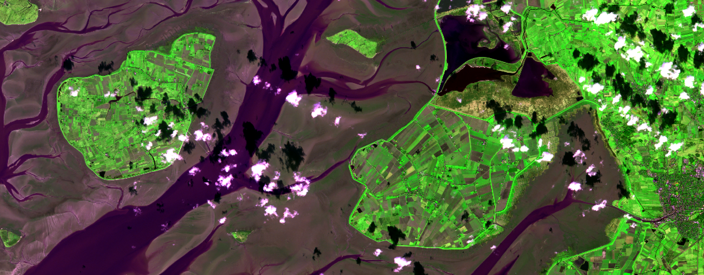
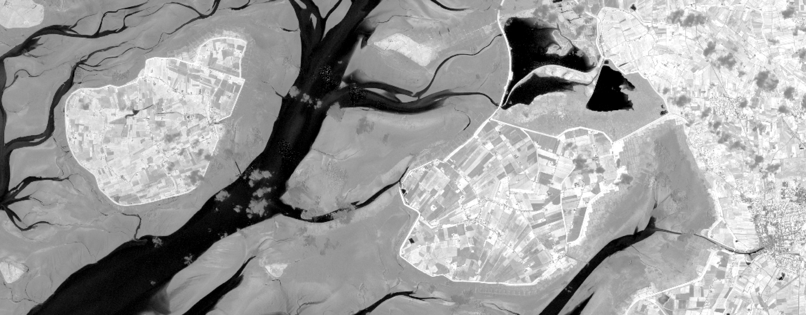
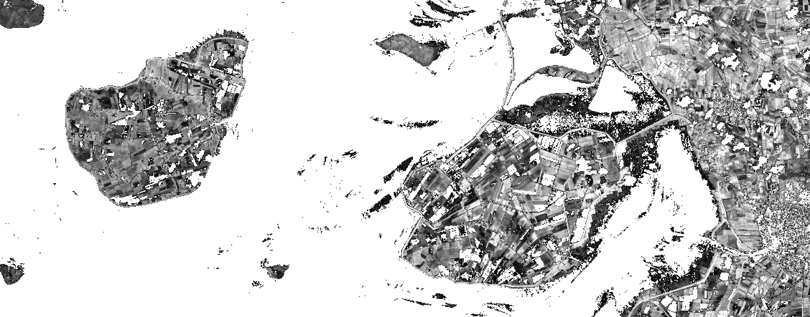
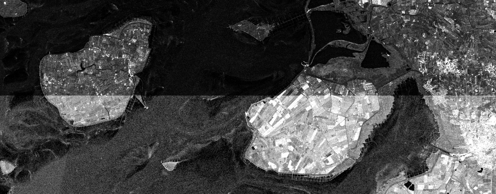
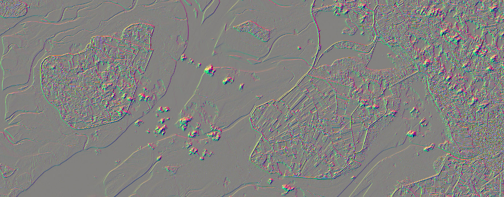

# OpenEO Cookbook - Chapter 2

In this second part of the cookbook, things are a bit less linear. We'll explore bandmath, masking and `apply_*` functionality, only that these steps are less interconnected than in the first tutorial. As before, you can change your preferred client language in the top right corner of all code examples. 

As usual we'll load a collection to work with (Sentinel 2, bands `2`, `4`, `8` and `SCL`). Let's call it `cube_s2`. We pre-select a time frame of which we know it only contains one Sentinel 2 scene, so that we're not bothered with multiple timesteps (the collection still contains a time dimension, but with only one timestep in it, so that it can be ignored). The extent has been chosen to provide results that are suitable to show the effect of the processes used, while being considerably small and thus fast to compute. If you want to minimize processing time you are of course free to use much smaller AOIs.

To be able to download and look at the results, refer to [chapter 1 - output](../cookbook/#raster-formats-gtiff-netcdf). The images in this tutorial were all downloaded as GTiff and plotted with R.

<CodeSwitcher>
<template v-slot:py>

```python
pellworm = {"west": 8.5464, "south": 54.4473, "east": 9.0724, "north": 54.5685}
t = ["2021-03-05", "2021-03-05"]

cube_s2 = con.load_collection(
    "SENTINEL2_L2A_SENTINELHUB",
    spatial_extent = pellworm,
    temporal_extent = t,
    bands = ["B02", "B04", "B08", "SCL"]
)
```

</template>
<template v-slot:r>

```r
pellworm <- list(west = 8.5464, south = 54.4473, east = 9.0724, north = 54.5685)
t <- c("2021-03-05", "2021-03-05")

cube_s2 <- p$load_collection(
  id = "SENTINEL2_L2A_SENTINELHUB",
  spatial_extent = pellworm,
  temporal_extent = t,
  bands=c("B02", "B04", "B08", "SCL")
)
```

</template>
<template v-slot:js>

```js
let pellworm = {"west": 8.5464, "south": 54.4473, "east": 9.0724, "north": 54.5685};
let t = ["2021-03-05", "2021-03-05"];

var cube_s2 = builder.load_collection(
    "SENTINEL2_L2A_SENTINELHUB",
    pellworm,
    t,
    ["B02", "B04", "B08", "SCL"]
);
```

</template>
</CodeSwitcher>


This is a false color image of our area of interest for this chapter. The bands `4`, `8` and `2` have been assigned to the RGB channels without any further processing. The surrounding area of the island Pellworm is shown at low tide.

## Bandmath
Bandmath refers to computations that involve multiple bands, like indices (Normalized Difference Vegetation Index, Normalized Burn Ratio etc.). 

In openEO, this goes along with using `reduce_dimension` over the `bands` dimension. In this process, a new pixel value is calculated from the values of different bands using a given formula (the actual bandmath), to then eliminate the `bands` dimension alltogether. If e.g. a cube contains a `red` and a `nir` band in its `bands` dimension and we reduce said dimension with a formula for the NDVI, that cube afterwards contains NDVI values, but no `bands` dimension anymore.

In the following we'll observe a thorough explanation of how to calculate an NDVI. That section covers different ways (depending on client) to set up such a process in openEO. Afterwards, we'll see how an EVI is computed in a quicker, less thorough example.

### Example 1: NDVI

As mentioned above, bandmath is about reducing the `bands` dimension with a child process (a formula) that gives us the desired output. In [chapter one](), we already saw different ways of defining a child process: a) We learned how to use a simple `mean` to [reduce the time dimension](../cookbook/#temporal-mean-reduce-dimension), and b) we saw how to access and use the openEO defined `linear_scale_range` function [to scale all pixels linearly](../cookbook/#scale-all-pixels-linearly-apply-linear-scale-range). 

In this chapter, we'll reiterate these techniques and discuss some subtleties and alternatives. It is up to you to choose one that works best for you. Special to the NDVI is, given that it is _the_ most common use case, that openEO has predefined processes that cover the math for us and only need to be given the correct bands. Thus we'll explore more and less manual ways of implementing this process.

The first method is universal to all clients: **Defining a function** and passing it to the process `reduce_dimension`. The section below contains a more detailed description for each client.

:::tip Important: Check Band Indices and Bandnames!
Be careful when handling the names or array indices of bands. While names differ across back-ends, indices can be mixed up easily when some other band is deleted from the input collection. Python and JavaScript have 0-based indices, R indices are 1-based. So double check which bands you're actually using.
:::

<CodeSwitcher>
<template v-slot:py>

```python
# necessary imports
from openeo.processes import array_element, normalized_difference

# define an NDVI function
def ndvi_fun(data):
    B04 = array_element(data, index = 0) # array_element takes either an index ..
    B08 = array_element(data, label = "B08") # or a label

    # ndvi = (B08 - B04) / (B08 + B04) # implement NDVI as formula ..
    ndvi = normalized_difference(B08, B04) # or use the openEO "normalized_difference" process
    
    return ndvi

# supply the defined function to a reduce_dimension process, set dimension = "bands"
cube_s2_ndvi = cube_s2.reduce_dimension(reducer = ndvi_fun, dimension = "bands")
```

What we see above:
* access specific bands inside the child process: `array_element` (supply data and index/label)
* call openEO defined functions inside the child process by importing it: `from openeo.processes import normalized_difference`
* write math as formula inside the child process: `ndvi = (B08 - B04) / (B08 + B04)`

The python client also holds a second possibility to do the above. It has a **function `band`** that does `array_element` and `reduce_dimension(dimension = "bands")` for us. When using it, we can type out the NDVI formula right in the script (since `.band` reduced the cube for us).

```python
# use "band()"
B04 = cube_s2.band("B04")
B08 = cube_s2.band("B08")

cube_s2_ndvi = (B08 - B04) / (B08 + B04) # type math formula
```

</template>
<template v-slot:r>

```r
# define an NDVI function
ndvi_fun <- function(data, context) {
  B04 <- data[2] # we can supply an index (1-based in R) ..
  B08 <- data["B08"] # or a label
  
  # ndvi <- (B08 - B04) / (B08 + B04) # implement NDVI as formula ..
  ndvi <- p$normalized_difference(B08, B04) # or use the openEO "normalized_difference" process
  # ndvi <- p$normalized_difference(data[2], data[3]) # or shorten all in one line

  return(ndvi)
}

# supply the defined function to a reduce_dimension process, set dimension = "bands"
cube_s2_ndvi <- p$reduce_dimension(data = cube_s2, reducer = ndvi_fun, dimension = "bands")
```

What we see above:
* access specific bands inside the child process by using array subset: `data[index]` or `data["bandname"]`
* call openEO defined functions inside the child process by calling it via the `p` processes environment: `p$normalized_difference`
* write math as formulas inside the child process: `ndvi <- (B08 - B04) / (B08 + B04)`

In R, there are no other ways to define a child process than through defining a function as seen above.

</template>
<template v-slot:js>

```js
// define NDVI function
var ndvi_fun = function(data, context) {
    B04 = data[0] // use array operator to extract bands
    B08 = data["B08"] // or supply label

    // Either approach down below works:

    // dif = this.subtract(B08, B04) // use "this" to access openEO processes inside this function
    // sum = this.sum(B08, B04)
    // ndvi = this.divide(dif, sum)

    ndvi = this.normalized_difference(B08, B04) // or use predefined "normalized_difference" instead of math

    // ndvi = this.normalized_difference(data[1], data[0]) // or shorten it all into one line
    
    return ndvi
}

// supply the defined function to a reduce_dimension process, set dimension = "bands"
cube_s2_ndvi = builder.reduce_dimension(cube_s2, ndvi_fun, "bands")
```

What we see above:
* access specific bands inside the child process by using array subset: `data[index]` or `data["bandname"]`
* call openEO defined functions inside the child process by calling it via `this`

We note that JavaScript doesn't support just typing out math functions as R and Python do. But the JS client has another, even simpler way of defining quick bandmath: **using `new Formula`**.

```js
// using "New Formula()", both $index and $label are valid as seen here
cube_s2_ndvi = builder.reduce_dimension(cube_s2, new Formula("($B08 - $1) / ($B08 + $1)"), "bands")
```

We see that using `new Formula("")` is much faster than defining a whole child process. We use `$` to access bands (works with `$indices` or `$bandnames`). If we want to use openEO defined processes, there's also the **arrow function** to still be able to do that in-line.

```js
// using an arrow function to call openeo process "normalized_difference"
cube_s2_ndvi = builder.reduce_dimension(cube_s2, (data, _, child) => child.normalized_difference(data[2], data[1]), "bands")
```

In an arrow function, we can use array subsets again.

To sum up: Although `new Formula` is probably the most straightforward way of calculating an NDVI, it is up to you to decide on a method that suits your use-case.

</template>
</CodeSwitcher>


A correctly calculated NDVI would look as displayed here.

### Example 2: EVI

The formula for the Enhanced Vegetation Index is a bit more complicated than the NDVI one and contains constants. But we also don't necessarily need an openEO defined function and can concentrate on implementing a more complex formula. Here's the most efficient way to do this, per client.

<CodeSwitcher>
<template v-slot:py>

```python
# extract and reduce all bands via "band"
B02 = cube_s2.band("B02")
B04 = cube_s2.band("B04")
B08 = cube_s2.band("B08")

# write formula
cube_s2_evi = (2.5 * (B08 - B04)) / ((B08 + 6.0 * B04 - 7.5 * B02) + 1.0)
```

</template>
<template v-slot:r>

```r
# in R, there's no shorter way to define bandmath
evi_ <- function(x, context) {
  b2 <- x[1]
  b4 <- x[2]
  b8 <- x[3]
  return((2.5 * (b8 - b4)) / ((b8 + 6 * b4 - 7.5 * b2) + 1))
}

# reduce_dimension bands with the defined formula
cube_s2_evi <- p$reduce_dimension(data = cube_s2, reducer = evi_, dimension = "bands")
```

</template>
<template v-slot:js>

```js
// "new Formula" is the quickest way to provide a bandmath formula
cube_s2_evi = builder.reduce_dimension(cube_s2, new Formula("(2.5 * ($2 - $1)) / (($2 + 6 * $1 - 7.5 * $0) + 1)"), "bands")
```

</template>
</CodeSwitcher>

## Masks: `mask`

Masking generally refers to excluding (or replacing) specific areas from an image. This is usually done by providing a boolean mask that detemines which pixels to replace with a no-data value, and which to leave as they are. In the following we will consider two cases: a) Creating a mask from classification classes and b) creating a mask by thresholding an image.

### Mask Out Specific Values

In some cases we want to mask our data with other data. A common example is to mask out clouds, which optical satellites can not see through. Some Sentinel 2 collections provide the `SCL` classification band (see the table of classes [at the bottom here](https://sentinels.copernicus.eu/web/sentinel/technical-guides/sentinel-2-msi/level-2a/algorithm)), providing a representation coded into land cover classes. In this classification, vegetation is coded as `4` and non-vegetation as `5`, while e.g. clouds are coded as `8` to `10`.

In the following, we're building a mask using some logical operations as a child process while reducing the dimension `bands`. As explained at [# Example 1: NDVI](#example-1-ndvi) this is done to be left with a cube that has no dimension `bands`. In R and JavaScript, we write a function `filter_` that turns the values of the `SCL` band into `0`s (for (non-) vegetation) and `1`s (for all others), and ignores all other bands. During `mask`, all `1`s (i.e. `TRUE`) pixels will be replaced, and as we don't define a replacement they will simply be set to `null`. In Python, in-line logical operations can be used.

<CodeSwitcher>
<template v-slot:py>

```python
# get classification band
SCL = cube.band("SCL")

# we want to mask all other values, so NOT (4 OR 5)
classification_mask = ~ ((SCL == 4) | (SCL == 5))

# masking
cube_s2_masked = cube_s2.mask(classification_mask)
```

</template>
<template v-slot:r>

```r
# define filter function to create mask
filter_ <- function(data, context) {
  SCL <- data[4] # select SCL band
  vegetation <- p$eq(SCL, 4) # vegetation is 4
  non_vegetation <- p$eq(SCL, 5) # non-vegetation is 5
  # we want to mask all other values, so NOT (4 OR 5)
  return(p$not(p$or(vegetation, non_vegetation)))
}

# create mask by reducing bands with our defined formula
cube_s2_mask <- p$reduce_dimension(data = cube_s2, reducer = filter_, dimension = "bands")

# mask the NDVI data
cube_s2_masked <- p$mask(cube_s2, cube_s2_mask)
```

</template>
<template v-slot:js>

```js
// filter classification layer
var filter_ = function(data, context) {
  SCL = data[3] // select SCL band
  vegetation = this.eq(SCL, 4) // vegetation is 4
  non_vegetation = this.eq(SCL, 5) // non-vegetation is 5
  // we want to mask all other values, so NOT (4 OR 5)
  return this.not(this.or(vegetation, non_vegetation))
}

// create mask by reducing bands
cube_s2_mask = builder.reduce_dimension(cube_s2, filter_, "bands")

// mask
cube_s2_masked = builder.mask(cube_s2, cube_s2_mask)
```

</template>
</CodeSwitcher>

As with all functionality there are differences between back-ends. If this first example "Mask Out Specific Values" doesn't work for you, that could be because we are trying to apply a mask (a cube with dimensions `x`, `y`, `t`) to the input data (a cube with dimensions `x`, `y`, `t`, `bands`) and thus, cubes with different dimensionality. If you encounter such a problem, try applying the first mask to the NDVI cube as it is shown in the second example "Thresholds".

### Thresholds

In this scenario we want an image that contains all NDVI values above 0.3, and holds `NA` values otherwise. This could be useful to have a look at the vegetation in the area, without being distracted by all other NDVI values. For this example we reuse the NDVI cube `cube_s2_ndvi` that was calculated in the [NDVI bandmath-example](#example-1-ndvi), thus for this to work you must include said code into your script.

If you look closely, you'll notice that this time we're not using `reduce_dimension` to construct our masking cube (in contrast to [Mask out Specific Values](#mask-out-specific-values)). In R and JavaScript we use `apply` instead, and in the python client no `.band()` is necessary anymore. This is because when we were masking using specific values of the band `SCL`, we were using the `cube_s2` (with the bands `B02`, `B04`, `B08` and `SCL`) as input. We then reduced the `bands` dimension by writing and passing the function `filter_`, which returned a cube that had no `bands` dimension anymore but `1`s and `0`s according to what we wanted to mask. 

Here, we are making a mask out of the `cube_s2_ndvi`, a cube that had its `band` dimension already reduced when the NDVI was calculated. To turn its values into `1`s and `0`s, we only need to `apply` a threshold function. For this we utilize the openEO defined function `lt` ("less than"). As usual the clients expose different ways of getting to that function, one of which is shown below.

<CodeSwitcher>
<template v-slot:py>

```python
# create mask that is TRUE for NDVI < 0.3
ndvi_threshold = cube_s2_ndvi < 0.3

# apply mask to NDVI
cube_s2_ndvi_masked = cube_s2_ndvi.mask(ndvi_threshold)
```

</template>
<template v-slot:r>

```r
threshold_ <- function(data, context) {
  # create mask that is TRUE for NDVI < 0.3
  threshold <- p$lt(data[1], 0.3)
  return(threshold)
}

# apply the threshold to the NDVI cube
ndvi_threshold <- p$apply(data = cube_s2_ndvi, process = threshold_)

# mask the NDVI cube with the calculated mask
s2_ndvi_masked <- p$mask(cube_s2_ndvi, s2_ndvi_mask)
```

</template>
<template v-slot:js>

```js
// create mask that is TRUE for NDVI < 0.3 via an arrow function
ndvi_threshold = builder.apply(cube_s2_ndvi, (data, _, child) => child.lt(data[0], 0.3))

// apply mask to NDVI cube
cube_s2_ndvi_masked = builder.mask(cube_s2_ndvi, ndvi_threshold)
```

</template>
</CodeSwitcher>


Applying the above described treshold to the NDVI yields this result. Water and artificial surfaces are mostly masked from the image.

## Pixel Operations: `apply`
As we remember from the [datacube guide](../datacubes.md#apply), unary processes take only the pixel itself into account when calculating new pixel values. We can implement that with the `apply` function and a child process that is in charge of modifying the pixel values. In our first example, that will be the square root. The openEO function is called `sqrt`. In the following we'll see how to pass it to the `apply` process.

<CodeSwitcher>
<template v-slot:py>

```python
# pass unary child process as string
cube_s2_sqrt = cube_s2.apply("sqrt")
```

</template>
<template v-slot:r>

```r
# pass unary child process as a function, call "sqrt" from openEO processes "p"
cube_s2_sqrt <- p$apply(cube_s2, function(x, context) { return(sqrt(x)) })
```

</template>
<template v-slot:js>

```js
// pass unary child process via arrow function
var cube_s2_sqrt = builder.apply(cube_s2, (data, _, child) => child.sqrt(data))
```

</template>
</CodeSwitcher>

Let's say we're not looking at optical but SAR imagery. Depending on the collection held by the back-end, this data could already be log-scaled. In case it isn't, we may want to transform our data from intensity values to db. This formula is a bit more complicated: 10 * log<sub>10</sub>(x). So we'll need a multiplication (by 10) and a `log` process (to the `base` 10).

Prior to applying the following code, we must load a collection containing SAR intensity data (e.g. Sentinel 1 GRD product). 

<CodeSwitcher>
<template v-slot:py>

```python
# import the defined openEO process
from openeo.processes import log

# define a child process
def log_(x):
  return 10 * log(x, 10)

# supply that function to the "apply" call
cube_s1_log10 = cube_s2.apply(log_)
```

</template>
<template v-slot:r>

```r
# call multiply, log functions from "p"
cube_s1_log10 <- p$apply(cube_s1, function(x, context) {p$multiply(10, p$log(x, 10))})
```

</template>
<template v-slot:js>

```js
// use openEO "log", "multiply" via arrow function
cube_s1_log = builder.apply(cube_s1, (data, _, child) => child.multiply(10, child.log(data, 10)))
```

</template>
</CodeSwitcher>


Above we see the effect of transforming intensity data to db: Both parts of the image are linearly scaled, but only the lower part has been `log`-transformed. It makes the interpretation much easier because image pixels are much less extreme.

## Image Kernels: `apply_kernel`

The process `apply_kernel` takes an array of weights that is used as a moving window to calculate new pixel values. This is often used to smooth or sharped the image (e.g. Gaussian blur or highpass filter, respectively). Here, we show two Sobel edge detection kernels (both vertical and horizontal) and a highpass filter.

We'll only consider band 8 to shorten computation time.

<CodeSwitcher>
<template v-slot:py>

```python
cube_s2_b8 = cube_s2.filter_bands(["B08"])
```

</template>
<template v-slot:r>

```r
cube_s2_b8 <- p$filter_bands(cube_s2, c("B08"))
```

</template>
<template v-slot:js>

```js
cube_s2_b8 = builder.filter_bands(cube_s2, ["B08"])
```

</template>
</CodeSwitcher>

Throughout all clients we can define the kernel as an array of arrays, of which the inner arrays represent lines (`x`) and the outer arrays columns (`y`). This means that by adding a line break after each inner array, a true representation of the kernel can be created (see `highpass` in Python or JavaScript tab).

The parameters `factor` and `border` are not needed here and are left out to fall back to default. `factor` (default `1`) is multiplied with each pixel after the focal operation, while `border` (default `0`) defines how overlaps between the kernel and the image borders are handled (should pixel values be mirrored, replicated or simply set to 0?, see [`apply_kernel`](../processes.html#apply_kernel)).

<CodeSwitcher>
<template v-slot:py>

```python
# we can pass a kernel as an array of arrays
sobel_vertical = [[1, 2, 1], [0, 0, 0], [-1, -2, -1]] # e.g. 3x3 edge detection
sobel_horizontal = [[1, 0, -1], [2, 0, -2], [1, 0, -1]]

highpass = [ # or 5x5 highpass filter
  [-1, -1, -1, -1, -1],
  [-1, -1, -1, -1, -1],
  [-1, -1, 24, -1, -1],
  [-1, -1, -1, -1, -1],
  [-1, -1, -1, -1, -1]
]

# apply to cube
cube_s2_highpass = cube_s2_b8.apply_kernel(highpass)
```

</template>
<template v-slot:r>

```r
# we can pass a kernel as an array of arrays
sobel_vertical <- matrix(c(1, 2, 1, 0, 0, 0, -1, -2, -1), nrow = 3, byrow = TRUE) 
sobel_horizontal <- matrix(c(1, 2, 1, 0, 0, 0, -1, -2, -1), nrow = 3) # e.g. 3x3 edge detection

highpass_vector <- c(rep(-1, 12), 24, rep(-1, 12))
highpass <- matrix(highpass_vector, nrow = 5) # or 5x5 highpass filter

# apply to cube
cube_s2_b8_highpass <- p$apply_kernel(cube_s2_b8, highpass)
```

**Note:** As of now, there seems to be the bug that the parameter `border` is wrongfully set as a string by the R client (see [issue on github](https://github.com/Open-EO/openeo-r-client/issues/65)). If you're executing this job via the [Web Editor](https://editor.openeo.org/), you can change this in the process graph itself: Change `"border": "0",` to `"border": 0,`.


</template>
<template v-slot:js>

```js
// we can pass a kernel as an array of arrays
let sobel_vertical = [[1, 2, 1], [0, 0, 0], [-1, -2, -1]] // e.g. 3x3 edge detection
let sobel_horizontal = [[1, 0, -1], [2, 0, -2], [1, 0, -1]]

let highpass = [ // or 5x5 highpass filter
  [-1, -1, -1, -1, -1],
  [-1, -1, -1, -1, -1],
  [-1, -1, 24, -1, -1],
  [-1, -1, -1, -1, -1],
  [-1, -1, -1, -1, -1]
]

// apply to cube
var cube_s2_highpass = builder.apply_kernel(cube_s2_b8, highpass)
```

</template>
</CodeSwitcher>


Above a combined edge detection RGB can be seen. Sobel 3x3 vertical and horizontal edge detections are displayed as red and green, a 5x5 highpass filter is displayed as blue. For this, all kernels in the code block above were applied and the sucessive cubes were merged afterwards.

Pre-defined processes (`median`, `max`, `sd` etc.) can be applied to spatial, temporal or even spatio-temporal neighbourhoods with **`apply_neighborhood`**. Due to lack of implementation by back-ends, this is not covered at this point.
