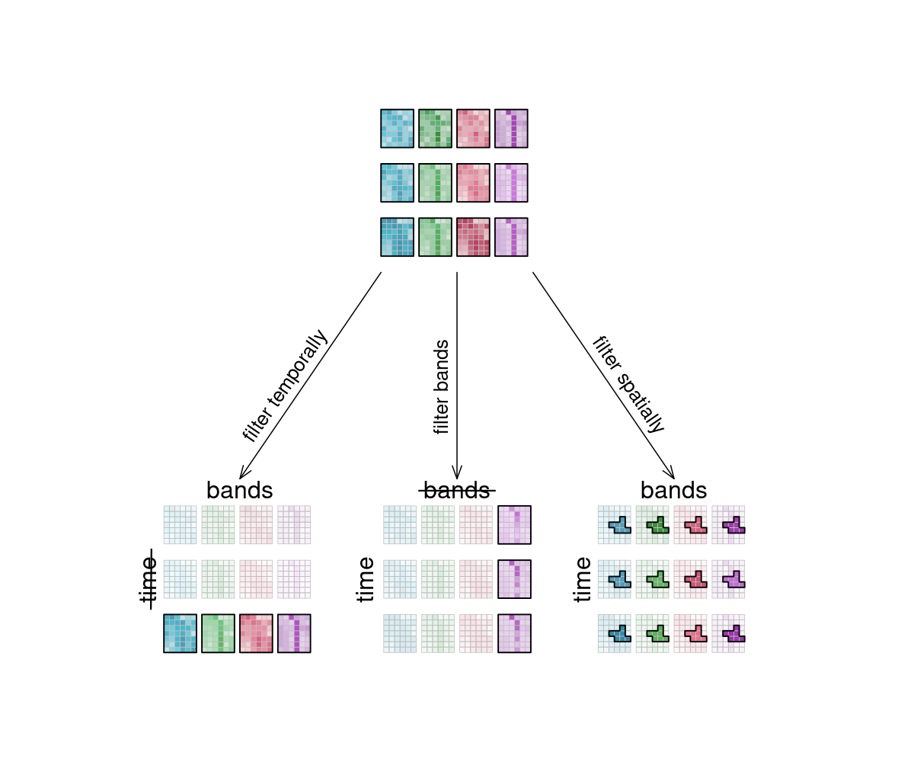

# Datacubes

Generic Intro

 TODOs / Questions:

 * use of "pixel" vs "datapoint" or something else that is arbitrary
 * address as "we"

## What are Datacubes?

Datacubes are multidimensional arrays with one or more spatial or temporal dimension(s). Most importantly, they are the way in which data is represented in OpenEO. They provide a nice and tidy interface for spatiotemproal data and the operations you may want to execute on it. As they are arrays, it might be easiest to look at _raster_ data as an example, even though datacubes can hold vector data as well: Then, the dimensions would have a different meaning. Instead of `x` and `y` they could e.g. represent stations with a number of sensors. Our example data however consists of a 6x7 raster with 4 bands [`red`, `green`, `blue`, `near-infrared`] and 3 time steps [`2020-10-01`, `2020-10-13`, `2020-10-25`], displayed here in an orderly, time series like manner:

<figure>
    
    <figcaption>6x7, new params</figcaption>
</figure>

It is important to understand that datacubes are designed to make things easier for us, and are not literally a cube, meaning that the above plot is just as good a way to represent the dimensionality than any other. That is why we can display the data how we want and play around a bit with the dimensions, including this view:

<figure>
    
    <figcaption>This is the 'raw' data collection that is included in our example datacube. The grayscale values of the imagery are colored accordingly for understandability.</figcaption>
</figure>

## Dimensions
 A dimension refers to a certain extent of a datacube. There are the obvious spatial dimensions x and y, and also the temporal dimension t. Furthermore there is the bands dimension, extending into the realm of _what_ is contained in the datacube.

 There are multiple additional properties stored for each dimension:

 * name
 * axis / number
 * type
 * extents _or_ nominal dimension labels
 * reference system / projections
 * resolution

Here is an overview of the dimensions contained in our example datacube above:

| # | dimension name | dimension labels | resolution |
|---|----------------|------------------| ---------- |
| 1 | x              |288790.5, 288819, 288847.5, 288876, 288904.5, 288933 | 30m |
| 2 | y              | 9120747, 9120718, 9120690, 9120661, 9120633, 9120604, 9120576 | 30m |
| 3 | bands          | `red`, `green`, `blue`, `nir` | 4 bands |
| 4 | time           | `2020-10-01`, `2020-10-13`, `2020-10-25` | 12 days |
 
 ### Processes on Dimensions
 Some processes are typically applied "along a dimension". You can imagine said dimension as an arrow and whatever is happening as a parallel process to that arrow. It simply means: "we focus on _this_ dimension right now".

 ### Resolution
 The resolution of a dimension gives information about what interval lies between observations. This is most obvious with the temporal resolution, where the intervals depict how often obervations were made. Spatial resolution gives information about the pixel spacing, meaning how many 'real world meters' are contained in a pixel. You can also think of how many bands you have as the resolution in the band dimension (i.e. spectral resolution).

## Functions on Datacubes

**Reducer/Reducing**: A reducer is a function that _reduces_, _shrinks_ and _compresses_ a certain dimension when calculating the result. For example a mean is such a function. It takes input values and _shrinks_ them down to just one result. If we apply a mean on a time series,  the time dimension is reduced, meaning it _stops existing_ (a mean value has no timestamp). If we apply a mean on x, y (calculating a mean for the whole extent) then the spatial dimensions are reduced. We still know that this mean represents the whole area which consisted of, let's say 100x100 pixels just a second ago, but the mean itself has no spatial dimensions anymore. Reducers must not necessarily remove the dimension. If we reduce an example bands dimension [B,G,R,NIR] by calculating a NDVI to [B,G,NDVI], then the band dimension was reduced but still exists.

### Filter

When filtering data, only the data within the filter interval is returned. That can be a time interval, coordinates or specific bands. The datacube is then smaller, according to the selected data.

Here, a specific region of a specific band [`blue`] of a specific time interval (let's say [`2020-10-10, 2020-10-24`]) is selected (_filtered_).

<figure>
    
    <figcaption>filter</figcaption>
</figure>

### Apply

When using `apply()`, the specified function is applied to all individual pixel values. An example is the absolute function (`abs()`). For each pixel (or data point), the absolute is computed and returned. This is called an unary function.

Furthermore there are the `apply_*()` processes (e.g `apply_kernel()`, `apply_dimension()`, `apply_neighbourhood()`). They typically apply a function under the consideration of a (multidimensional) neighbourhood, or along a dimension. That could be a smoothing function applied spatially and/or temporally. The new pixel value is then calculated taking into account a pixel neighbourhood and/or a time series of the pixel. This is called a n-ary function.

Original dimensions and their resolutions usually remain unchanged when `apply()`-ing some process.

<figure>
    
    <figcaption>apply, close up</figcaption>
</figure>

### Resample

In a resampling process, the _layout_ of a certain dimension is changed into another _layout_, most likely also changing the resolution of that dimension. This is done by mapping values of the source (old) datacube to the new layout of the target (new) datacube. During that process, resolutions can be _upscaled_ or _downscaled_, depending on whether they have a finer or a coarser spacing afterwards. A prominent example is to reproject a datacube.
### Reduce

The `reduce_dimension*()` process _collapses_ a whole dimension of the datacube. It does so by using some sort of _reducer_, which is a function that calculates a single result from an amount of values, as e.g. `mean()`, `min()` and `max()` are. For example can we reduce the time dimension by calculating the mean for each pixel in that time series. We are left with a cube that has no time dimension, because all values are compressed into a single mean value. The same goes for e.g. the spatial dimensions: If we calculate the mean along the `x` and `y` dimensions, we are left without any spatial dimensions, but a mean value for each "image".

Think of it as a waste press that does math instead of using brute force. Given a representation of our example data cube, let's see how it is affected.

<figure>
    
    <figcaption>reduce</figcaption>
</figure>

### Aggregate

