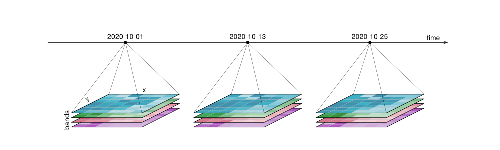
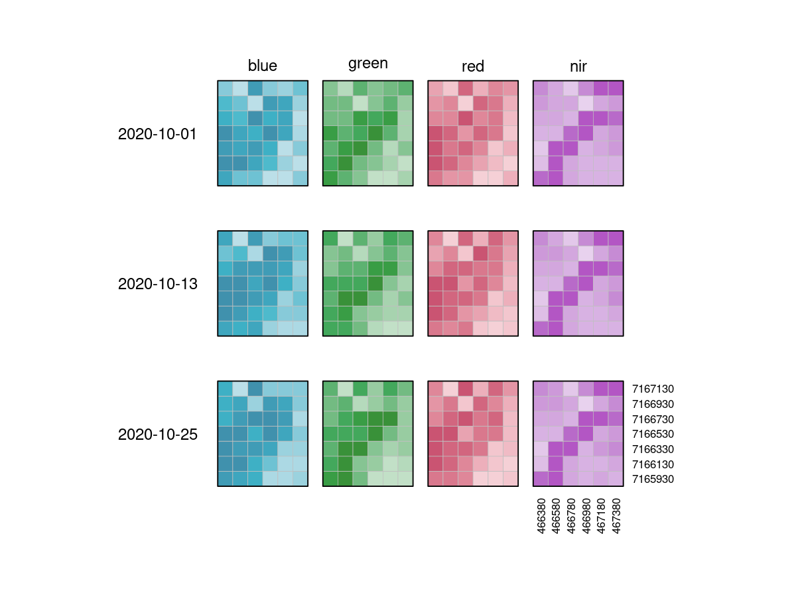
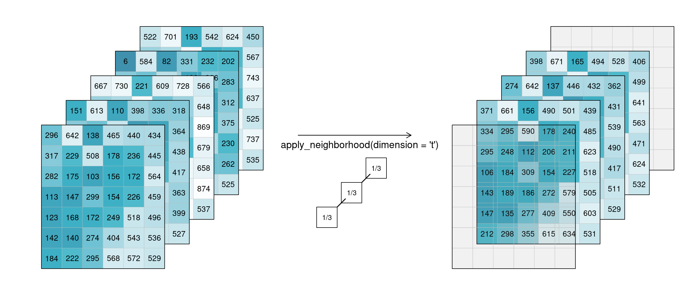
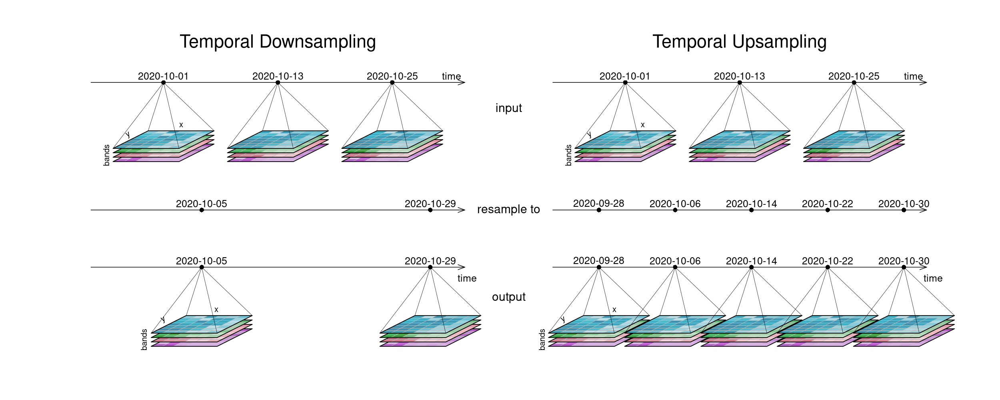
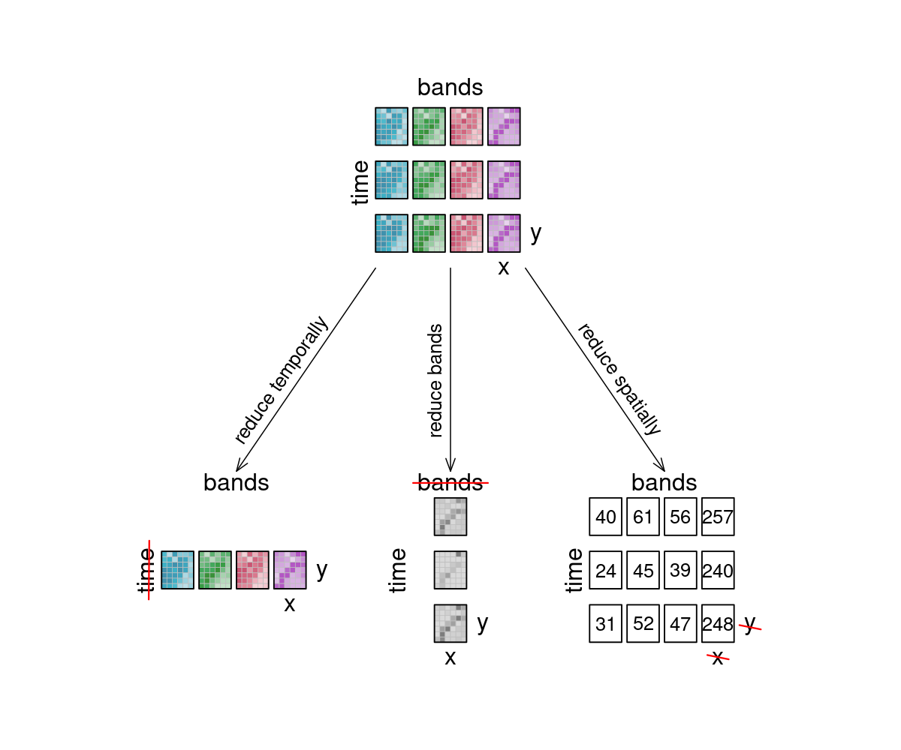

# Datacubes

## What are Datacubes?

Datacubes are multidimensional arrays with one or more spatial or temporal dimension(s). They are the way in which data is represented in OpenEO. They provide a nice and tidy interface for spatiotemporal data as well as the operations you may want to execute on it. As they are arrays, it might be easiest to look at raster data as an example, even though datacubes can hold vector data as well. Our example data however consists of a 6x7 raster with 4 bands [`blue`, `green`, `red`, `near-infrared`] and 3 timesteps [`2020-10-01`, `2020-10-13`, `2020-10-25`], displayed here in an orderly, timeseries-like manner:

<figure>
    
    <figcaption>An examplary datacube with 4 dimensions: x, y, bands and time.</figcaption>
</figure>

It is important to understand that datacubes are designed to make things easier for us, and are not literally a cube, meaning that the above plot is just as good a representation as any other. That is why we can switch the dimensions around and display them in whatever way we want, including the view below:

<figure>
    
    <figcaption>This is the 'raw' data collection that is our example datacube. The grayscale images are colored for understandability, and dimension labels are displayed.</figcaption>
</figure>

## Dimensions
A dimension refers to a certain axis of a datacube. Our exemplary raster datacube has the spatial dimensions `x` and `y`, and the temporal dimension `t`. Furthermore it has a `bands` dimension, extending into the realm of _what kind of information_ is contained in the cube.

The following properties are usually available for dimensions:

* name
* axis / number
* type (spatial/temporal/bands/other)
* extents _or_ nominal dimension labels
* reference system / projections
* resolution

Here is an overview of the dimensions contained in our example datacube above:

| # | dimension name | dimension labels | resolution |
|---|----------------|------------------| ---------- |
| 1 | `x`              | `466380`, `466580`, `466780`, `466980`, `467180`, `467380` | 10m |
| 2 | `y`             | `7167130`, `7166930`, `7166730`, `7166530`, `7166330`, `7166130`, `7165930` | 10m |
| 3 | `bands`          | `blue`, `green`, `red`, `nir` | 4 bands |
| 4 | `t`              | `2020-10-01`, `2020-10-13`, `2020-10-25` | 12 days |

### Applying Processes on Dimensions
Some processes are typically applied "along a dimension". You can imagine said dimension as an arrow and whatever is happening as a parallel process to that arrow. It simply means: "we focus on _this_ dimension right now".

### Resolution
The resolution of a dimension gives information about what interval lies between observations. This is most obvious with the temporal resolution, where the intervals depict how often observations were made. Spatial resolution gives information about the pixel spacing, meaning how many 'real world meters' are contained in a pixel. You can also think of how many bands you have as the resolution in the `bands` dimension (i.e. spectral resolution).

## Processes on Datacubes

In the following part, the basic processes for manipulating datacubes are introduced.

### Filter

When filtering data (e.g. [`filter_spatial`](https://processes.openeo.org/#filter_spatial), [`filter_temporal`](https://processes.openeo.org/#filter_temporal), [`filter_bands`](https://processes.openeo.org/#filter_bands)), only the data that satisfies a condition is returned. For example, this condition could be a timestamp or interval, (a set of) coordinates, or specific bands. By applying filtering the datacube becomes smaller, according to the selected data.

In the image, the example datacube can be seen at the top with labeled dimensions. The filtering techniques are displayed separately below. On the left, the datacube is filtered temporally with the interval `["2020-10-15", "2020-10-27"]`. The result is a cube with only the rasters for the timestep that lies within that interval (`"2020-10-25"`) and unchanged bands and spatial dimensions. Likewise, the original cube is filtered for a specific band `["nir"]` in the middle and a specific spatial region `[Polygon(...)]` on the right.

<figure>
    
    <figcaption>Filtering the sample datacube. It is displayed at the top with dimensions labels. Filtered results are shown at the bottom.</figcaption>
</figure>

### Apply

The `apply*` functions (e.g. [`apply`](https://processes.openeo.org/#apply), [`apply_dimension`](https://processes.openeo.org/#apply_dimension), [`apply_kernel`](https://processes.openeo.org/#apply_kernel)) employ a process on the datacube that calculates new pixel values for each pixel, based on `n` other pixels.

For the case `n = 1` this is called an unary function and means that only the pixel itself is considered when calculating the new pixel value. A prominent example is the `absolute()` function, calculating the absolute value of the input pixel value. 

<figure>
    
    <figcaption>Applying an unary process. Only the pixel itself is considered for calculating the new pixel value.</figcaption>
</figure>

If `n` is larger than 1, the function is called n-ary. In practice, this means that the pixel neighbourhood is taken into account to calculate the new pixel value. Such neighbourhoods can be of temporal and/or spatial nature. A temporal function works on a time series at a certain pixel location (e.g. smoothing values over time), a spatial function works on a kernel that weights the surrounding pixels (e.g. smoothing values with nearby observations).

In the example below, an example weighted kernel (shown in the middle) is applied to the cube. To avoid edge effects (affecting pixels on the edge of the image with less neighbours), a padding has been added in the background.

<figure>
    
    <figcaption>Applying a spatial kernel. For calculating each new pixel value, the defined weighted neighbourhood is used.</figcaption>
</figure>

Of course this also works for temporal neighbourhoods (timeseries), considering neighbours before and after a pixel. To be able to show the effect, two timesteps were added in this example figure. A moving average of window size 3 is then applied. While this process is applied to all pixels in the cube, a specific pixel timeseries is highlighted (green line) and processed step-by-step. No padding was added which is why we observe edge effects (NA values are returned for t1 and t5, because their temporal neighbourhood is missing input timesteps).

<figure>
    
    <figcaption>Applying a moving average (temporal smoothing) by averaging the direct temporal neighbourhoods of pixels. No padding is used, which leads to edge effects.</figcaption>
</figure>

### Resample

In a resampling processes (e.g. [`resample_cube_spatial`](https://processes.openeo.org/#resample_cube_spatial), [`resample_cube_temporal`](https://processes.openeo.org/#resample_cube_temporal)), the _layout_ of a certain dimension is changed into another _layout_, most likely also changing the resolution of that dimension. This is done by mapping values of the source (old) datacube to the new layout of the target (new) datacube. During that process, resolutions can be _upscaled_ or _downscaled_ (also called _upsampling_ and _downsampling_), depending on whether they have a finer or a coarser spacing afterwards. A function is then needed to translate the existing data into the new resolution. A prominent example is to reproject a datacube into the coordinate reference system of another datacube, for example in order to merge the two cubes.

The first figure gives an overview of temporal resampling. How exactly the input timesteps are rescaled to the output timesteps depends on the resampling function.

<figure>
    
    <figcaption>Temporal downsampling is seen on the left, upsampling on the right. The temporal layout that the cubes are resampled to is displayed in the middle.</figcaption>
</figure>

The second figure displays spatial resampling. Observe how in the upsampling process, the output datacube has not gained in information value. The resulting grid still carries the same pixel information, but in higher spatial resolution.

<figure>
    
    <figcaption>Spatial resampling. The geometry which the input cube is resampled to is displayed in the middle. The output cube then contains the same information, but in the resampled spatial layout.</figcaption>
</figure>

### Reduce

The [`reduce_dimension`](https://processes.openeo.org/#reduce_dimension) process _collapses_ a whole dimension of the datacube. It does so by using some sort of **reducer**, which is a function that calculates a single result from an amount of values, as e.g. `mean()`, `min()` and `max()` are. For example we can reduce the time dimension (`t`) of a timeseries by calculating the mean value of all timesteps for each pixel. We are left with a cube that has no time dimension, because all values of that dimension are compressed into a single mean value. The same goes for e.g. the spatial dimensions: If we calculate the mean along the `x` and `y` dimensions, we are left without any spatial dimensions, but a mean value for each instance that previously was a raster is returned. In the image below, the dimensions that are reduced are crossed out in the result.

Think of it as a waste press that does math instead of using brute force. Given a representation of our example datacube, let's see how it is affected.

<figure>
    
    <figcaption>Overview of reducing the sample datacube. Dimensions that are reduced are crossed out in the result images. Their information value has been compressed by a reducer function.</figcaption>
</figure>

### Aggregate

An aggregation of a datacube can be thought of as a grouped reduce. That means it consists of two steps: 

1. Grouping via a grouping variable, i.e. spatial geometries or temporal intervals
2. Reducing these groups along the grouped dimension with a certain reducer function, e.g. calculating the mean pixel value per polygon or the maximum pixel values per month

While the layout of the reduced dimension is changed, other dimensions keep their resolution and geometry. But in contrast to pure `reduce`, the dimension along which `aggregate` is performed still exists after the operation.

A temporal aggregation (e.g. [`aggregate_temporal`](https://processes.openeo.org/#aggregate_temporal)) is similar to the downsampling process, as it can be seen in the according image above. Intervals for grouping can either be set manually, or periods can be chosen: monthly, yearly, etc. All timesteps in an interval are then collapsed via a reducer function (`mean`, `max`, etc.) and assigned to the given new labels.

A spatial agregation (e.g. [`aggregate_spatial`](https://processes.openeo.org/#aggregate_spatial)) works in a similar manner. Polygons, lines and points can be selected for grouping. Their spatial dimension is then reduced by a given process and thus, a vector cube is returned. The vector cube then has dimensions containing features, attributes and time. In the graphic below, the grouping is only shown for the first timestep. 

<figure>
    
    <figcaption>When aggregating spatially, pixels are grouped (cut out) based on geometries, and then collapsed with a reducer function. A vector datacube is returned (as shown with dimensions names and labels).</figcaption>
</figure>
