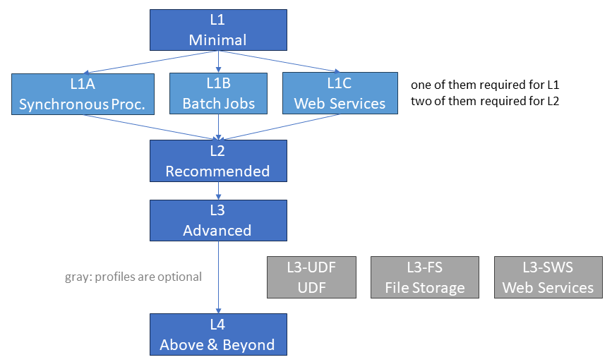

# API Profiles

The following image provides an overview of the openEO API profiles.
The minimal profile that allows an openEO API implementation to be called "openEO-compliant" is *L1 Minimal* with additionally compliance to at least of L1A, L1B, or L1C.

<figure>
     L1A/B/C -> L2 Recommended -> L3 Advanced (with sub-profiles) -> L4 Above and Beyond">
    <figcaption>An overview of the openEO API profiles.</figcaption>
</figure>

- *L1 Minimal* ensures that the openEO implementation has a minimal set of functionality which allow users to execute basic use-cases.
- *L2 Recommended* add functionality that we recommend to be available so that users can more effectively make use of the openEO implementation.
- *L3 Advanced* allows users to execute more advanced use cases. The sub-profiles can add a specific set of functionalities centered around specific needs:
  - *L3-UDF* adds support for User-Defined Functions (users can run custom source code)
  - *L3-FS* adds support for File Storage (users can upload, use, and delete custom files)
  - *L3-SWS* adds advanced suppoort for Secondary Web Services (e.g. on-demand processing through a tiling service such as OGC WMTS)
- *L4 Above and Beyond* adds very specific and complex requirements for very specific and highly advanced use cases. Additionally, there are also various API extensions defined in the API specification, which are not listed as part of the profiles.

In the following chapter you can find a list of requirements per profile, grouped by categories.

## Requirements per Profile

### L1: Minimal

#### API fundamentals

| # | Functionality | Description |
| -- | -- | -- |
| 1 | All > CORS | OPTIONS method with all headers |
| 2 | All > CORS | Access-Control-Allow-Origin for GET, POST, PUT, PATCH, DELETE |
| 3 | All > CORS | Access-Control-Expose-Headers for GET, POST, PUT, PATCH, DELETE |
| 4 | All > HTTPS | HTTPS supported |
| 5 | All > UTF-8 | Charset is UTF-8 for all requests and responses |
| 6 | All > Error Handling | Returns HTTP status codes between 400 and 599 for errors |
| 7 | All > Error Handling | Returns a JSON object with at least code and message properties |
| 13 | All > Process Graphs | Callback support |

#### Well-known Discovery

| # | Functionality | Description |
| -- | -- | -- |
| 21 | `GET /.well-known/openeo` | Valid response with at least url and api_version per instance (without authentication) |

#### Capabilities

| # | Functionality | Description |
| -- | -- | -- |
| 30 | `GET /` | Valid response with at least api/backend/stac_version, id, title, description, endpoints and links (w/o auth) |
| 31 | `GET /` > endpoints | All implemented endpoints listed with methods |
| 32 | `GET /` > endpoints | No endpoints listed that are not implemented or faulty |
| 33 | `GET /` > api_version | Implements openEO API version 1.2.0 (or 1.1.0) |
| 34 | `GET /` > stac_version | Implements STAC version 1.0.0 (or 0.9.0) |

#### File Formats

| # | Functionality | Description |
| -- | -- | -- |
| 40 | `GET /file_formats` | Valid response with input and output properties |
| 41 | `GET /file_formats` | Works without authentication |
| 42 | `GET /file_formats` | Works with authentication |
| 43 | `GET /file_formats` > output | At least one output file format available |
| 46 | `GET /file_formats` | File format names get accepted case Insensitive |
| 48 | `GET /file_formats` | Each format has at least gis_data_types and parameters |

#### Authentication

| # | Functionality | Description |
| -- | -- | -- |
| 100 |  | Bearer token follows the specified format (method/identityProviderId/token) |
| 101 | All that require a Bearer token > Error Handling | Returns HTTP status codes 401 if no authentication details are provided |
| 102 | All that require a Bearer token > Error Handling | Returns HTTP status codes 403 if invalid credentials or credentials with insufficient permissions are provided |
| 110 | `GET /credentials/*` | At least one authentication method is supported (HTTP Basic or OIDC) |

#### Pre-defined Processes

| # | Functionality | Description |
| -- | -- | -- |
| 200 | `GET /processes` | Valid response with at least processes and links as arrays |
| 201 | `GET /processes` | Works without authentication |
| 202 | `GET /processes` | Works with authentication |
| 204 | `GET /processes` > limit parameter | All processes are returned if no limit parameter is provided |
| 209 | `GET /processes` > processes | Missing properties in the process objects are not set to null if not valid according to the OpenAPI schema |

#### Collections

| # | Functionality | Description |
| -- | -- | -- |
| 300 | `GET /collections` | Valid response with at least collections and links as arrays |
| 301 | `GET /collections` | Works without authentication |
| 302 | `GET /collections` | Works with authentication |
| 303 | `GET /collections` | Supports a valid STAC version (0.9.0 or later, preferrably 1.0.0). |
| 306 | `GET /collections` > limit parameter | All collections are returned if no limit parameter is provided |
| 307 | `GET /collections` > collections | All collections are valid according to the STAC specification 0.9 or later (stac_version, id, description, license, extent and links are required) |
| 313 | `GET /collections` > collections | Missing properties in the collection objects are not set to null if not valid according to the OpenAPI schema |
| 320 | `GET /collections/{id}` | Is supported |
| 321 | `GET /collections/{id}` | Response is valid according to the STAC specification 0.9 or later (additionally, cube:dimensions and summaries are required) |
| 322 | `GET /collections/{id}` | Works without authentication |
| 323 | `GET /collections/{id}` | Works with authentication |
| 326 | `GET /collections/{id}` > cube:dimensions | All collections provide their actual data cube dimensions |

#### Data Processing

| # | Functionality | Description |
| -- | -- | -- |
| 700 | status | Job follows described status changes (see description of status property in GET /jobs/{id}) |
| 701 |  | At least one of batch jobs, secondary web services or synchronous processing is implemented |

### L1A: Minimal - Synchronous Processing

#### Synchronous Processing

| # | Functionality | Description |
| -- | -- | -- |
| 900 | `POST /result` | Is supported (with authentication) |
| 901 | `POST /result` > process | Only accepts valid process submissions |
| 905 | `POST /result` | Returns HTTP status 200 on success with the data in the response body, HTTP status codes 4XX or 5XX on failure with valid response body |
| 906 | `POST /result` > Content-Type header | Returns suitable media type for the requested file format (not always application/octet-stream) in the Content-Type header |
| 910 | `POST /result` | Rejects processing if a payment is required. |

### L1B: Minimal - Batch Jobs

#### Batch Jobs

| # | Functionality | Description |
| -- | -- | -- |
| 710 | `GET /jobs` | Is supported (with authentication) |
| 711 | `GET /jobs` | Valid response with at least jobs and links as arrays |
| 713 | `GET /jobs` > limit parameter | All jobs are returned if no limit parameter is provided |
| 714 | `GET /jobs` > jobs | The served job metadata is valid according to the specification (id, status and created are required) |
| 715 | `GET /jobs` > jobs | title is provided for all jobs (if provided by the user) |
| 730 | `POST /jobs` | Supports creating batch jobs (with authentication) |
| 731 | `POST /jobs` > process | Only accepts valid process submissions |
| 734 | `POST /jobs` | Supports storing title and description |
| 736 | `POST /jobs` | Returns HTTP status 201 and OpenEO-Identifier + Location header if successful |
| 737 | `POST /jobs` > status | Job status is "created" after successful creation of the job, the data processing does not start yet |
| 750 | `GET /jobs/{id}` | Is supported (with authentication) |
| 751 | `GET /jobs/{id}` | Returns at least id, process, status and created |
| 752 | `GET /jobs/{id}` | title and description are available if provided by the user |
| 754 | `GET /jobs/{id}` > status | Correctly reports status (and progress, if supported) |
| 780 | `DELETE /jobs/{id}` | Is supported (with authentication) |
| 781 | `DELETE /jobs/{id}` | Deletes the job and returns a HTTP 204 on success, otherwise a 4XX. |

#### Batch Jobs > Results

| # | Functionality | Description |
| -- | -- | -- |
| 850 | `POST /jobs/{id}/results` | Supports queueing/starting jobs (with authentication) |
| 851 | `POST /jobs/{id}/results` | Queues or starts the processing, which is reflected in the job status. Does nothing if already queued or running. Responds with HTTP status 202. |
| 852 | `POST /jobs/{id}/results` | Rejects queueing a job if a payment is required. |
| 860 | `GET /jobs/{id}/results` | Is supported (with authentication) |
| 861 | `GET /jobs/{id}/results` | Returns HTTP status code 200 if the result is available, HTTP status code 424 with error message if the job status is "error", 4XX/5XX otherwise. |
| 863 | `GET /jobs/{id}/results` > partial parameter | If processing has not finished and the partial parameter is not set to true, requests are rejected with openEO error JobNotFinished. |
| 865 | `GET /jobs/{id}/results` > STAC | Response is a valid STAC Item or Collection |
| 866 | `GET /jobs/{id}/results` > STAC | Supports a valid STAC version (0.9.0 or later, preferrably 1.0.0). |
| 869 | `GET /jobs/{id}/results` > STAC | Assets all have an href and type, ideally also a title |
| 870 | `GET /jobs/{id}/results` > STAC | Additional metadata is provided for the results (e.g. extents, projection, bands, dimensions). Please provide details in the comments. |
| 871 | `GET /jobs/{id}/results` > public access link | Support canonical links (a public access signed URL, exposed as link with relation type canonical) |
| 872 | `GET /jobs/{id}/results` > public access link | Exposes the expires property in the response body |
| 890 | `DELETE /jobs/{id}/results` | Is supported (with authentication) |
| 891 | `DELETE /jobs/{id}/results` | Cancels data processing (if queued or running), optionally deletes the batch job results and returns a HTTP 202 on success. |

### L1C: Minimal - Secondary Web Services

#### Secondary Web Service Discovery

| # | Functionality | Description |
| -- | -- | -- |
| 600 | `GET /service_types` | Is supported |
| 601 | `GET /service_types` | Works without authentication |
| 602 | `GET /service_types` | Works with authentication |
| 603 | `GET /service_types` | Valid response with at least configuration and process_parameters per service |

#### Secondary Web Services

| # | Functionality | Description |
| -- | -- | -- |
| 610 | `GET /services` | Is supported (with authentication) |
| 611 | `GET /services` | Valid response with at least services and links as arrays |
| 613 | `GET /services` > limit parameter | All services are returned if no limit parameter is provided |
| 614 | `GET /services` > services | The served service metadata is valid according to the specification (id, url, type and enabled are required) |
| 615 | `GET /services` > services | title is provided for all services (if provided by the user) |
| 630 | `POST /services` | Supports creating services (with authentication) |
| 631 | `POST /services` > process | Only accepts valid process submissions |
| 632 | `POST /services` > configuration | Supports configuration parameters, rejects invalid configuration parameters |
| 633 | `POST /services` > type | Rejects invalid types, accepts types case insensitive |
| 636 | `POST /services` | Supports storing title, description and enabled |
| 638 | `POST /services` | Returns HTTP status 201 and OpenEO-Identifier + Location header if successful |
| 650 | `GET /services/{id}` | Is supported (with authentication) |
| 651 | `GET /services/{id}` | Returns at least id, url, type, enabled, process, configuration and attributes |
| 652 | `GET /services/{id}` | title and description are available if provided by the user |
| 680 | `DELETE /services/{id}` | Is supported (with authentication) |
| 681 | `DELETE /services/{id}` | Deletes the service and returns a HTTP 204 on success, otherwise a 4XX. |

### L2: Recommended

#### API fundamentals

| # | Functionality | Description |
| -- | -- | -- |
| 9 | All > Process Graphs | Namespace support |
| 11 | All > Process Graphs | Use user-defined processes (in process_id) |
| 12 | All > Process Graphs | Parameter support (use of from_parameter) |

#### Well-known Discovery

| # | Functionality | Description |
| -- | -- | -- |
| 20 | `GET /.well-known/openeo` | Not part of the main API tree / not versioned |

#### Capabilities

| # | Functionality | Description |
| -- | -- | -- |
| 35 | `GET /` > billing | Billing information are provided |

#### File Formats

| # | Functionality | Description |
| -- | -- | -- |
| 44 | `GET /file_formats` | File format names aligned with GDAL |
| 47 | `GET /file_formats` | Each format has a description describing their structure and relation to data cubes. |
| 49 | `GET /file_formats` | title and description are provided for all file formats |

#### Authentication

| # | Functionality | Description |
| -- | -- | -- |
| 112 | `GET /credentials/oidc` | OIDC is supported (without authentication for discovery requests) |

#### User Account

| # | Functionality | Description |
| -- | -- | -- |
| 120 | `GET /me` | Is supported (with authentication) |
| 121 | `GET /me` > user_id | Returns a unique user ID |

#### Pre-defined Processes

| # | Functionality | Description |
| -- | -- | -- |
| 206 | `GET /processes` > processes | All processes are customized to reflect the actual implementation status (removal of unsupported parameters, updates to parameter schemas, etc.) |
| 207 | `GET /processes` > processes | Summaries and categories are provided for all processes |

#### Collections

| # | Functionality | Description |
| -- | -- | -- |
| 304 | `GET /collections` | Implements STAC API - Collections (https://api.stacspec.org/v1.0.0/collections) |
| 308 | `GET /collections` > collections | License links are provided for non-SPDX license identifiers |
| 309 | `GET /collections` > collections | All collections provide a title and keywords |
| 310 | `GET /collections` > collections | Extents report the actual availability of data and don't overpromise |
| 325 | `GET /collections/{id}` > stac_extensions | Lists all extensions that are used in the document |

#### User-defined processes

| # | Functionality | Description |
| -- | -- | -- |
| 400 | `GET /process_graphs` | Is supported (with authentication) |
| 401 | `GET /process_graphs` | Valid response with at least processes and links as arrays |
| 403 | `GET /process_graphs` > limit parameter | All processes are returned if no limit parameter is provided |
| 404 | `GET /process_graphs` > processes | All stored processes are valid according to the specification (id is required) |
| 405 | `GET /process_graphs` > processes | Missing properties in the process objects are not set to null if missing (allowed only for: summary, description, parameters, returns) |
| 410 | `PUT /process_graphs/{id}` > create | Supports creating new processes (with authentication) |
| 411 | `PUT /process_graphs/{id}` > update | Supports updating existing processes (required only if creating new processes is supported) |
| 412 | `PUT /process_graphs/{id}` | Only accepts valid process submissions (id and process_graph required, given process must be valid) |
| 413 | `PUT /process_graphs/{id}` > id | If the id given in the request body is not equal to the given process_graph_id in the path, updates the id given in the request body. |
| 414 | `PUT /process_graphs/{id}` | Fully replaces the process if a user-defined process with the given ID exists. |
| 420 | `GET /process_graphs/{id}` | Is supported (with authentication) |
| 421 | `GET /process_graphs/{id}` | Valid response with at least id and process_graph |
| 422 | `GET /process_graphs/{id}` | Missing properties in the process objects are not set to null if missing (allowed only for: summary, description, parameters, returns) |
| 430 | `DELETE /process_graphs/{id}` | Is supported (with authentication) |
| 431 | `DELETE /process_graphs/{id}` | Deletes the process and returns a HTTP 204 on success, otherwise a 4XX. |

#### Data Processing

| # | Functionality | Description |
| -- | -- | -- |
| 702 |  | At least two of batch jobs, secondary web services or synchronous processing are implemented |

#### Batch Jobs

| # | Functionality | Description |
| -- | -- | -- |
| 710 | `GET /jobs` | Is supported (with authentication) |
| 711 | `GET /jobs` | Valid response with at least jobs and links as arrays |
| 713 | `GET /jobs` > limit parameter | All jobs are returned if no limit parameter is provided |
| 714 | `GET /jobs` > jobs | The served job metadata is valid according to the specification (id, status and created are required) |
| 715 | `GET /jobs` > jobs | title is provided for all jobs (if provided by the user) |
| 730 | `POST /jobs` | Supports creating batch jobs (with authentication) |
| 731 | `POST /jobs` > process | Only accepts valid process submissions |
| 734 | `POST /jobs` | Supports storing title and description |
| 736 | `POST /jobs` | Returns HTTP status 201 and OpenEO-Identifier + Location header if successful |
| 737 | `POST /jobs` > status | Job status is "created" after successful creation of the job, the data processing does not start yet |
| 750 | `GET /jobs/{id}` | Is supported (with authentication) |
| 751 | `GET /jobs/{id}` | Returns at least id, process, status and created |
| 752 | `GET /jobs/{id}` | title and description are available if provided by the user |
| 754 | `GET /jobs/{id}` > status | Correctly reports status (and progress, if supported) |
| 780 | `DELETE /jobs/{id}` | Is supported (with authentication) |
| 781 | `DELETE /jobs/{id}` | Deletes the job and returns a HTTP 204 on success, otherwise a 4XX. |

#### Batch Jobs > Logs

| # | Functionality | Description |
| -- | -- | -- |
| 800 | `GET /jobs/{id}/logs` | Is supported (with authentication) |
| 801 | `GET /jobs/{id}/logs` > offset parameter | Supports query parameter offset, only returns log entries that were logged after the given offset |
| 804 | `GET /jobs/{id}/logs` | Valid response with at least logs and links as arrays |
| 805 | `GET /jobs/{id}/logs` > level | level property is available if log_level has been set for the job or the level parameter has been provided |
| 806 | `GET /jobs/{id}/logs` > logs | The served log entries are valid according to the specification (id, level and message are required) |
| 807 | `GET /jobs/{id}/logs` > logs | time is supported, core and data is supported if applicable |
| 808 | `GET /jobs/{id}/logs` > logs | The message is short and concise, doesn't contain full stack traces. |

#### Batch Jobs > Results

| # | Functionality | Description |
| -- | -- | -- |
| 850 | `POST /jobs/{id}/results` | Supports queueing/starting jobs (with authentication) |
| 851 | `POST /jobs/{id}/results` | Queues or starts the processing, which is reflected in the job status. Does nothing if already queued or running. Responds with HTTP status 202. |
| 852 | `POST /jobs/{id}/results` | Rejects queueing a job if a payment is required. |
| 860 | `GET /jobs/{id}/results` | Is supported (with authentication) |
| 861 | `GET /jobs/{id}/results` | Returns HTTP status code 200 if the result is available, HTTP status code 424 with error message if the job status is "error", 4XX/5XX otherwise. |
| 863 | `GET /jobs/{id}/results` > partial parameter | If processing has not finished and the partial parameter is not set to true, requests are rejected with openEO error JobNotFinished. |
| 865 | `GET /jobs/{id}/results` > STAC | Response is a valid STAC Item or Collection |
| 866 | `GET /jobs/{id}/results` > STAC | Supports a valid STAC version (0.9.0 or later, preferrably 1.0.0). |
| 869 | `GET /jobs/{id}/results` > STAC | Assets all have an href and type, ideally also a title |
| 870 | `GET /jobs/{id}/results` > STAC | Additional metadata is provided for the results (e.g. extents, projection, bands, dimensions). Please provide details in the comments. |
| 871 | `GET /jobs/{id}/results` > public access link | Support canonical links (a public access signed URL, exposed as link with relation type canonical) |
| 872 | `GET /jobs/{id}/results` > public access link | Exposes the expires property in the response body |
| 890 | `DELETE /jobs/{id}/results` | Is supported (with authentication) |
| 891 | `DELETE /jobs/{id}/results` | Cancels data processing (if queued or running), optionally deletes the batch job results and returns a HTTP 202 on success. |

#### Synchronous Processing

| # | Functionality | Description |
| -- | -- | -- |
| 900 | `POST /result` | Is supported (with authentication) |
| 901 | `POST /result` > process | Only accepts valid process submissions |
| 905 | `POST /result` | Returns HTTP status 200 on success with the data in the response body, HTTP status codes 4XX or 5XX on failure with valid response body |
| 906 | `POST /result` > Content-Type header | Returns suitable media type for the requested file format (not always application/octet-stream) in the Content-Type header |
| 910 | `POST /result` | Rejects processing if a payment is required. |

### L3: Advanced

#### API fundamentals

| # | Functionality | Description |
| -- | -- | -- |
| 8 | All > Error Handling | Additionally returns id and/or url properties |
| 10 | All > Process Graphs | Multiple result nodes (e.g. save result as GeoTiff and netCDF) |

#### Well-known Discovery

| # | Functionality | Description |
| -- | -- | -- |
| 22 | `GET /.well-known/openeo` | Lists production and development instance (if applicable) |

#### Conformance Classes

| # | Functionality | Description |
| -- | -- | -- |
| 60 | `GET /conformance` | Is supported (without authentication) |
| 61 | `GET /conformance` | Valid response with at least conformsTo |

#### Authentication

| # | Functionality | Description |
| -- | -- | -- |
| 111 | `GET /credentials/basic` | HTTP Basic is not supported in production |

#### Pre-defined Processes

| # | Functionality | Description |
| -- | -- | -- |
| 203 | `GET /processes` > limit parameter | Support for pagination, incl. pagination links |

#### Collections

| # | Functionality | Description |
| -- | -- | -- |
| 305 | `GET /collections` > limit parameter | Support for pagination, incl. pagination links |
| 330 | `GET /collections/{id}/queryables` | Is supported and valid JSON Schema |

#### User-defined processes

| # | Functionality | Description |
| -- | -- | -- |
| 402 | `GET /process_graphs` > limit parameter | Support for pagination, incl. Pagination links |

#### Validation

| # | Functionality | Description |
| -- | -- | -- |
| 490 | `POST /validation` | Is supported (with authentication) |
| 491 | `POST /validation` | For valid input: HTTP 200 returning an empty errors array |
| 492 | `POST /validation` | For invalid input: HTTP 200 with a non-empty errors array. Each objects contains at least code and message. |
| 493 | `POST /validation` | HTTP status codes 4XX and 5XX are not used to indicate errors in the process. They only indicate invalid HTTP requests or server errors |
| 494 | `POST /validation` > id | Checks validity of process id |
| 495 | `POST /validation` > parameters | Checks validity of parameters (e.g. JSON Schema) |
| 496 | `POST /validation` > returns | Checks validity of return value (e.g. JSON Schema) |
| 497 | `POST /validation` > process_graph | Checks validity of provided process graph (e.g. parameters used, processes available, parameters provided valid, …) |

#### Batch Jobs

| # | Functionality | Description |
| -- | -- | -- |
| 712 | `GET /jobs` > limit parameter | Support for pagination, incl. pagination links |
| 732 | `POST /jobs` > billing | Has billing support (plan, budget) |
| 733 | `POST /jobs` > log_level | Supports setting a min. log level |
| 735 | `POST /jobs` > additionalProperties | Accepts/supports additional properties (if applicable) - please provide a list of them in the comments |
| 753 | `GET /jobs/{id}` | Has billing support (plan, costs, budget, usage) |
| 755 | `GET /jobs/{id}` > additionalProperties | Correctly reflects additional properties set during job creation (or after job update) |
| 760 | `PATCH /jobs/{id}` | Supports updating batch jobs (with authentication) |
| 764 | `PATCH /jobs/{id}` | Supports updating title and description |

#### Batch Jobs > Logs

| # | Functionality | Description |
| -- | -- | -- |
| 802 | `GET /jobs/{id}/logs` > level parameter | Supports query parameter level |
| 803 | `GET /jobs/{id}/logs` > limit parameter | Support for pagination, incl. pagination links |

#### Batch Jobs > Estimates

| # | Functionality | Description |
| -- | -- | -- |
| 820 | `GET /jobs/{id}/estimate` | Is supported (with authentication), provides at least one of costs, duration or size |
| 821 | `GET /jobs/{id}/estimate` > costs | Supports cost estimates |
| 824 | `GET /jobs/{id}/estimate` > downloads_included | Specifies how many full downloads of the processed data are included in the estimate. |
| 825 | `GET /jobs/{id}/estimate` > expires | Specifies the time until the estimate is valid. |
| 826 | `GET /jobs/{id}/estimate` | Returns with HTTP 200 on success and returns with HTTP status 500 and error code EstimateComplexity if an estimate can't be computed. |

#### Batch Jobs > Results

| # | Functionality | Description |
| -- | -- | -- |
| 864 | `GET /jobs/{id}/results` > OpenEO-Costs header | Supports the OpenEO-Costs header |
| 867 | `GET /jobs/{id}/results` > STAC | Supports a full STAC hierachy (i.e. childs/items in a Collection) |

#### Synchronous Processing

| # | Functionality | Description |
| -- | -- | -- |
| 902 | `POST /result` > billing | Has billing support (plan, budget) |
| 903 | `POST /result` > log_level | Supports setting a min. log level |
| 904 | `POST /result` > additionalProperties | Accepts/supports additional properties (if applicable) - please provide a list of them in the comments |
| 907 | `POST /result` > OpenEO-Costs header | Returns OpenEO-Costs header |
| 908 | `POST /result` > Link header | Returns a link to logs in the Link header (relation type "monitor") |
| 909 | `POST /result` > multiple files | Supports TAR file format (or other archive format) if multiple files get generated |

### L3-UDF: UDF

#### UDF Runtimes

| # | Functionality | Description |
| -- | -- | -- |
| 71 | `GET /udf_runtimes` | Is supported |
| 72 | `GET /udf_runtimes` | Works without authentication |
| 73 | `GET /udf_runtimes` | Works with authentication |
| 74 | `GET /udf_runtimes` | Valid response with at least type, default and versions per UDF runtime |
| 75 | `GET /udf_runtimes` | title and description are provided for all fUDF runtimes |

### L3-FS: File Storage

#### File Storage

| # | Functionality | Description |
| -- | -- | -- |
| 500 | `GET /files` | Is supported (with authentication) |
| 501 | `GET /files` | Valid response with at least files and links as arrays |
| 502 | `GET /files` > limit parameter | Support for pagination, incl. pagination links |
| 503 | `GET /files` > limit parameter | All processes are returned if no limit parameter is provided |
| 504 | `GET /files` > files | The served file metadata is valid according to the specification (path is required) |
| 505 | `GET /files` > files | File sizes and modification dates are provided |
| 506 | `GET /files` > files | Paths are valid according to the specification (no leading slash, unix-style separator, no URL encoding) |
| 510 | `PUT /files/{path}` | Supports uploading  files (with authentication) |
| 511 | `PUT /files/{path}` | Paths are correctly parsed (works around the OpenAPI limitation) |
| 512 | `PUT /files/{path}` | Support for folders |
| 513 | `PUT /files/{path}` | Overrides existing files if applicable |
| 520 | `GET /files/{path}` | Is supported (with authentication) |
| 521 | `GET /files/{path}` | Provides the file content, correctly encoded (upload + download don't change the checksum of the files) and with a suitable media type |
| 530 | `DELETE /files/{path}` | Is supported (with authentication) |
| 531 | `DELETE /files/{path}` | Deletes the file and returns a HTTP 204 on success, otherwise a 4XX. |

### L3-SWS: Secondary Web Services

#### Secondary Web Service Discovery

| # | Functionality | Description |
| -- | -- | -- |
| 600 | `GET /service_types` | Is supported |
| 601 | `GET /service_types` | Works without authentication |
| 602 | `GET /service_types` | Works with authentication |
| 603 | `GET /service_types` | Valid response with at least configuration and process_parameters per service |
| 604 | `GET /service_types` | title and description are provided for all services |

#### Secondary Web Services

| # | Functionality | Description |
| -- | -- | -- |
| 610 | `GET /services` | Is supported (with authentication) |
| 611 | `GET /services` | Valid response with at least services and links as arrays |
| 612 | `GET /services` > limit parameter | Support for pagination, incl. pagination links |
| 613 | `GET /services` > limit parameter | All services are returned if no limit parameter is provided |
| 614 | `GET /services` > services | The served service metadata is valid according to the specification (id, url, type and enabled are required) |
| 615 | `GET /services` > services | title is provided for all services (if provided by the user) |
| 630 | `POST /services` | Supports creating services (with authentication) |
| 631 | `POST /services` > process | Only accepts valid process submissions |
| 632 | `POST /services` > configuration | Supports configuration parameters, rejects invalid configuration parameters |
| 633 | `POST /services` > type | Rejects invalid types, accepts types case insensitive |
| 634 | `POST /services` > billing | Has billing support (plan, budget) |
| 635 | `POST /services` > log_level | Supports setting a min. log level |
| 636 | `POST /services` | Supports storing title, description and enabled |
| 638 | `POST /services` | Returns HTTP status 201 and OpenEO-Identifier + Location header if successful |
| 650 | `GET /services/{id}` | Is supported (with authentication) |
| 651 | `GET /services/{id}` | Returns at least id, url, type, enabled, process, configuration and attributes |
| 652 | `GET /services/{id}` | title and description are available if provided by the user |
| 653 | `GET /services/{id}` | Has billing support (plan, costs, budget, usage) |
| 660 | `PATCH /services/{id}` | Supports updating services (with authentication) |
| 661 | `PATCH /services/{id}` > process | Allows updating processes, but only accepts valid process submissions |
| 662 | `PATCH /services/{id}` > configuration | Supports updating configuration parameters |
| 663 | `PATCH /services/{id}` > configuration | Rejects invalid configuration parameters |
| 664 | `PATCH /services/{id}` > type | Rejects invalid types, accepts types case insensitive |
| 665 | `PATCH /services/{id}` > billing | Has billing support (plan, budget) |
| 666 | `PATCH /services/{id}` > log_level | Supports updating the min. log level |
| 667 | `PATCH /services/{id}` > enabled | Supports enabling/disabling the service |
| 668 | `PATCH /services/{id}` | Supports updating title and description |
| 680 | `DELETE /services/{id}` | Is supported (with authentication) |
| 681 | `DELETE /services/{id}` | Deletes the service and returns a HTTP 204 on success, otherwise a 4XX. |

### L4: Above and Beyond

#### Secondary Web Services

| # | Functionality | Description |
| -- | -- | -- |
| 616 | `GET /services` | Supports on-demand web services (processing while using the service) |
| 617 | `GET /services` | Supports viewing of batch job results (processing beforehand as batch job, i.e. load_result -> save process) |
| 637 | `POST /services` > additionalProperties | Accepts/supports additional properties (if applicable) - please provide a list of them in the comments |
| 654 | `GET /services/{id}` > additionalProperties | Correctly reflects additional properties set during service creation (or after service update) |
| 669 | `PATCH /services/{id}` > additionalProperties | Accepts/supports additional properties (if applicable) |

#### Secondary Web Services > Logs

| # | Functionality | Description |
| -- | -- | -- |
| 690 | `GET /services/{id}/logs` | Is supported (with authentication) |
| 691 | `GET /services/{id}/logs` > offset parameter | Supports query parameter offset, only returns log entries that were logged after the given offset |
| 692 | `GET /services/{id}/logs` > level parameter | Supports query parameter level |
| 693 | `GET /services/{id}/logs` > limit parameter | Support for pagination, incl. pagination links |
| 694 | `GET /services/{id}/logs` | Valid response with at least logs and links as arrays |
| 695 | `GET /services/{id}/logs` > level | level property is available if log_level has been set for the service or the level parameter has been provided |
| 696 | `GET /services/{id}/logs` > logs | The served log entries are valid according to the specification (id, level and message are required) |
| 697 | `GET /services/{id}/logs` > logs | time is supported, core and data is supported if applicable |
| 698 | `GET /services/{id}/logs` > logs | The message is short and concise, doesn't contain full stack traces. |

#### Batch Jobs

| # | Functionality | Description |
| -- | -- | -- |
| 761 | `PATCH /jobs/{id}` > process | Allows updating processes, but only accepts valid process submissions |
| 762 | `PATCH /jobs/{id}` > billing | Has billing support (plan, budget) |
| 763 | `PATCH /jobs/{id}` > log_level | Supports updating the min. log level |
| 765 | `PATCH /jobs/{id}` > additionalProperties | Accepts/supports additional properties (if applicable) |

#### Batch Jobs > Estimates

| # | Functionality | Description |
| -- | -- | -- |
| 822 | `GET /jobs/{id}/estimate` > duration | Supports runtime duration estimates |
| 823 | `GET /jobs/{id}/estimate` > size | Supports result file size estimates |

#### Batch Jobs > Results

| # | Functionality | Description |
| -- | -- | -- |
| 862 | `GET /jobs/{id}/results` > partial parameter | Supports partial query parameter |
