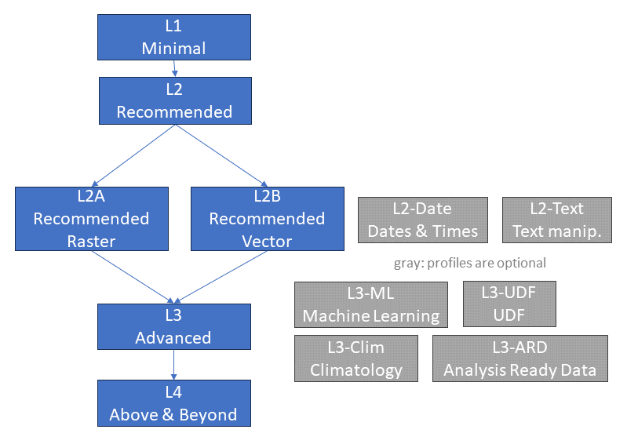

# Process Profiles

The following image provides an overview of the openEO Processes profiles.
The minimal profile that allows an openEO implementation to be called "openEO-compliant" is *L1 Minimal*.

<figure>
     L2 Recommended (with sub-profiles) -> L2A/B Raster/Vector -> L3 Advanced (with sub-profiles) -> L4 Above and Beyond">
    <figcaption>An overview of the openEO Processes profiles.</figcaption>
</figure>

- *L1 Minimal* ensures that the openEO implementation has a minimal set of functionality which allow users to execute basic use-cases.
- *L2 Recommended* add functionality that we recommend to be available so that users can more effectively make use of the openEO implementation.
- *L3 Advanced* allows users to execute more advanced use cases.
- *L4 Above and Beyond* adds very specific and complex requirements for very specific and highly advanced use cases.

There are various sub-profiles in L2 (e.g., L2-Date) and L3 (e.g., L3-ML) that add a specific set of functionalities centered around specific needs such as date/time manipulation or execution of machine learning workflows.

In the following chapter you can find a list of requirements per profile.

## Requirements per Profile

::: tip Note
Missing experimental processes should (by default) lead to a "warning", but not lead to a rejection of that level in openEO.
:::

### L1: Minimal

- **`absolute`**
- **`add`**
- **`and`**
- **`apply`**
  - Parameter `context`: is supported and passed to the callback
- **`apply_dimension`**
  - Parameter `process`: Supports access to labels in the callback
  - All dimensions that your datacubes can include are supported - x and y can usually be excluded
- **`arccos`**
- **`arcsin`**
- **`arctan`**
- **`array_concat`**
- **`array_create`**
- **`array_element`**
- **`between`**
- **`ceil`**
- **`clip`**
- **`constant`**
- **`cos`**
- **`divide`**
- **`e`**
- **`eq`**
- **`exp`**
- **`first`**
- **`floor`**
- **`gt`**
- **`gte`**
- **`int`**
- **`last`**
- **`ln`**
- **`load_collection`**
  - Parameter `temporal_extent`: All temporal formats are supported (date-time and date)
- **`log`**
- **`lt`**
- **`lte`**
- **`max`**
- **`mean`**
- **`median`**
- **`min`**
- **`mod`**
- **`multiply`**
- **`neq`**
- **`not`**
- **`or`**
- **`pi`**
- **`power`**
- **`product`**
- **`quantiles`**
- **`reduce_dimension`**
  - Parameter `reducer`: At least all processes (up to L1) in the category `reducer` that accept an array as input and return a single value as output can be used (also in a chain of processes).
  - Parameter `dimension`: All dimensions that your datacubes can include are supported - x and y are excluded as they are handled with reduce_spatial
- **`round`**
- **`save_result`**
- **`sd`**
- **`sgn`**
- **`sin`**
- **`sqrt`**
- **`subtract`**
- **`sum`**
- **`tan`**
- **`variance`**

### L2: Recommended

- **`add_dimension`**
  - Parameter `name`: All suitable dimensions are supported
- **`aggregate_temporal`**
  - Parameter `reducer`: At least all processes (up to the level of this requirement) in the category `reducer` that accept an array as input and return a single value as output can be used (also in a chain of processes).
  - Parameter `reducer`: Supports access to labels in the callback
  - Parameter `dimension`: All suitable dimensions are supported
- **`aggregate_temporal_period`**
  - Parameter `reducer`: At least all processes (up to the level of this requirement) in the category `reducer` that accept an array as input and return a single value as output can be used (also in a chain of processes).
  - Parameter `reducer`: Supports access to labels in the callback
  - Parameter `dimension`: All suitable dimensions are supported
  - Parameter `period`: `enum` reflects implemention (all values are supported)
- **`all`**
- **`any`**
- **`arcosh`**
- **`arctan2`**
- **`array_element`**
  - Supports labeled arrays
- **`array_find`**
- **`arsinh`**
- **`artanh`**
- **`cosh`**
- **`count`**
- **`dimension_labels`**
  - Parameter `dimension`: All suitable dimensions are supported
- **`drop_dimension`**
  - Parameter `name`: All suitable dimensions are supported
- **`extrema`**
- **`filter_bbox`**
- **`filter_temporal`**
  - Parameter `dimension`: All suitable dimensions are supported
  - All temporal formats are supported (date-time and date)
- **`if`**
- **`inspect`** (experimental)
  - Parameter `level`: `enum` reflects implemention (all values are supported)
- **`is_nan`**
- **`is_nodata`**
- **`is_valid`**
- **`linear_scale_range`**
- **`nan`** (experimental)
- **`normalized_difference`**
- **`reduce_dimension`**
  - Parameter `reducer`: At least all processes (up to L2) in the category `reducer` that accept an array as input and return a single value as output can be used (also in a chain of processes).
  - Parameter `reducer`: Supports access to labels in the callback
- **`rename_dimension`**
- **`rename_labels`**
  - Parameter `dimension`: All dimensions that your datacubes can include are supported - x and y can usually be excluded
- **`sinh`**
- **`sort`**
- **`tanh`**
- **`xor`**

### L2A: Recommended Raster

- **`aggregate_spatial`**
  - Parameter `reducer`: At least all processes (up to the level of this requirement) in the category `reducer` that accept an array as input and return a single value as output can be used (also in a chain of processes).
- **`apply_kernel`**
  - Parameter `border`: `enum` reflects implemention (all values are supported)
- **`filter_bands`**
  - Supports filtering by band name
- **`filter_spatial`**
- **`load_collection`**
  - Parameter `bands`: Supports filtering by band name and common name
- **`mask`**
- **`mask_polygon`**
- **`resample_spatial`**
  - Parameter `method`: `enum` reflects implemention (all values are supported)

### L2B: Recommended Vector

- **`filter_vector`** (experimental)
- **`vector_buffer`** (experimental)
- **`vector_reproject`** (experimental)

### L2-Date: Date & Time manipulation

- **`date_between`** (experimental)
- **`date_difference`** (experimental)
- **`date_shift`** (experimental)

### L2-Text: Text manipulation

- **`text_begins`**
- **`text_concat (text_merge)`**
- **`text_contains`**
- **`text_ends`**

### L3: Advanced

- **`add_dimension`**
  - Parameter `type`: `enum` reflects implemention (all values are supported)
- **`aggregate_spatial`**
  - Parameter `reducer`: Supports access to labels in the callback
  - Parameter `context`: is supported and passed to the callback
- **`aggregate_spatial_window`** (experimental)
- **`aggregate_temporal`**
  - Parameter `context`: is supported and passed to the callback
  - All temporal formats are supported (date-time, date and time)
- **`aggregate_temporal_period`**
  - Parameter `context`: is supported and passed to the callback
- **`apply`**
  - Parameter `process`: At least all processes (up to the level of this requirement) in the categories `comparison`, `logic` and `math` can be used (also in a chain of processes).
- **`apply_dimension`**
  - Parameter `process`: At least all processes (up to the level of this requirement) in the categories `array`, `comparison`, `logic` and `math` can be used (also in a chain of processes).
  - Parameter `context`: is supported and passed to the callback
- **`apply_neighborhood`**
  - Parameter `process`: Supports access to labels in the callback
  - Parameter `context`: is supported and passed to the callback
  - Parameter `data`: All listed label types supported.
  - Parameter `size` / `overlap`: Units `m`, `px` and `null` are supported
- **`array_append`**
  - Supports labeled arrays
- **`array_apply`**
  - Parameter `process`: Supports access to labels in the callback
  - Parameter `context`: is supported and passed to the callback
  - Supports labeled arrays
- **`array_concat`**
  - Supports labeled arrays
- **`array_contains`**
- **`array_create_labeled`** (experimental)
- **`array_filter`**
  - Parameter `context`: is supported and passed to the callback
  - Supports labeled arrays
- **`array_find_label`** (experimental)
- **`array_interpolate_linear`**
  - Supports labeled arrays
- **`array_labels`**
- **`array_modify`** (experimental)
  - Supports labeled arrays
- **`cloud_detection`** (experimental)
- **`count`**
  - Parameter `context`: is supported and passed to the callback
- **`create_data_cube (create_raster_cube)`**
- **`cummax`** (experimental)
- **`cummin`** (experimental)
- **`cumproduct`** (experimental)
- **`cumsum`** (experimental)
- **`filter_bands`**
  - Supports filtering by common name
- **`filter_labels`** (experimental)
  - Parameter `context`: is supported and passed to the callback
  - Parameter `dimension`: All suitable dimensions are supported
- **`flatten_dimensions`** (experimental)
- **`is_infinite`** (experimental)
- **`load_collection`**
  - Parameter `properties`: Supports querying by queryables defined via the API.
- **`load_geojson`** (experimental)
- **`load_stac (load_result)`** (experimental)
  - Supports loading from STAC API - Features.
  - Supports loading from STAC API - Item Search.
  - Supports loading from static STAC.
  - Parameter `temporal_extent`: All temporal formats are supported (date-time and date)
  - Parameter `bands`: Supports filtering by band name and common name
- **`merge_cubes`**
  - Parameter `context`: is supported and passed to the callback
- **`ndvi`**
  - Supports common names as band names
- **`order`**
- **`rearrange`**
- **`reduce_dimension`**
  - Parameter `context`: is supported and passed to the callback
- **`reduce_spatial`** (experimental)
  - Parameter `reducer`: At least all processes (up to the level of this requirement) in the category `reducer` that accept an array as input and return a single value as output can be used (also in a chain of processes).
  - Parameter `reducer`: Supports access to labels in the callback
  - Parameter `context`: is supported and passed to the callback
- **`resample_cube_spatial`**
  - Parameter `method`: `enum` reflects implemention (all values are supported)
- **`resample_cube_temporal`**
  - Parameter `dimension`: All suitable dimensions are supported
- **`resample_spatial`**
  - Parameter `align`: `enum` reflects implemention (all values are supported)
- **`trim_cube`**
- **`unflatten_dimensions`** (experimental)
- **`vector_to_random_points`** (experimental)
- **`vector_to_regular_points`** (experimental)

### L3-ML: Machine Learning

- **`fit_curve`** (experimental)
- **`fit_regr_random_forest`**
- **`load_ml_model`** (experimental)
- **`predict_curve`** (experimental)
- **`save_ml_model`** (experimental)

### L3-UDF: User-Defined Functions

- **`run_udf`**
  - Parameter `context`: is supported and passed to the callback
- **`run_udf_externally`** (experimental)

### L3-Clim: Cimatology

- **`anomaly`**
- **`climatological_normal`**

### L3-ARD: Analysis-Ready Data

- **`ard_normalized_radar_backscatter`** (experimental)
  - has been tested on > 100x100km at 10m resolution (or equivalent)
  - Custom parameters are provided via the `options` parameter
- **`ard_surface_reflectance`** (experimental)
  - Parameter `atmospheric_correction_method`: `enum` reflects implemention (all values are supported)
  - Parameter `cloud_detection_method`: `enum` reflects implemention (all values are supported)
  - Custom parameters are provided via the `atmospheric_correction_options` and/or `cloud_detection_options` parameters

### L4: Above and Beyond

- **`aggregate_spatial`**
  - Parameter `reducer`: At least all processes (up to the level of this requirement) in the categories `array`, `comparison`, `logic` and `math` can be used (also in a chain of processes).
- **`aggregate_temporal`**
  - Parameter `reducer`: At least all processes (up to the level of this requirement) in the categories `array`, `comparison`, `logic` and `math` can be used (also in a chain of processes).
- **`aggregate_temporal_period`**
  - Parameter `reducer`: At least all processes (up to the level of this requirement) in the categories `array`, `comparison`, `logic` and `math` can be used (also in a chain of processes).
- **`apply_neighborhood`**
  - Parameter `process`: At least all processes (up to the level of this requirement) in the categories `array`, `comparison`, `logic` and `math` can be used (also in a chain of processes).
- **`apply_polygon (chunk_polygon)`** (experimental)
- **`array_apply`**
  - Parameter `process`: At least all processes (up to the level of this requirement) in the categories `comparison`, `logic` and `math` can be used (also in a chain of processes).
- **`atmospheric_correction`** (experimental)
  - Parameter `method`: `enum` reflects implemention (all values are supported)
  - Custom parameters are provided via the `options` parameter
- **`filter_bands`**
  - Supports filtering by wavelength
- **`filter_bbox`**
  - Parameter `extent`: Supports filtering by base/height
- **`load_collection`**
  - Parameter `spatial_extent`: Supports filtering by base/height
- **`load_stac (load_result)`** (experimental)
  - Parameter `spatial_extent`: Supports filtering by base/height
- **`load_uploaded_files`** (experimental)
- **`load_url`** (experimental)
- **`reduce_dimension`**
  - Parameter `reducer`: At least all processes (up to the level of this requirement) in the categories `array`, `comparison`, `logic` and `math` can be used (also in a chain of processes).
- **`reduce_spatial`** (experimental)
  - Parameter `reducer`: At least all processes (up to the level of this requirement) in the categories `array`, `comparison`, `logic` and `math` can be used (also in a chain of processes).
- **`sar_backscatter`** (experimental)
  - Parameter `coefficient`: `enum` reflects implemention (all values are supported)
  - Custom parameters are provided via the `options` parameter
