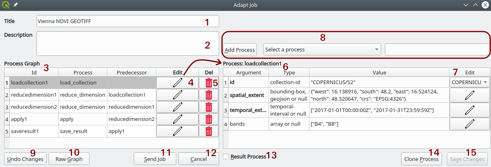
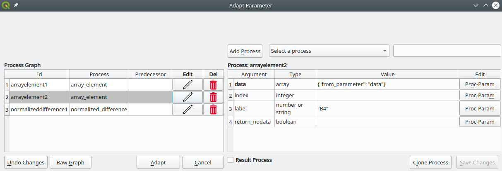
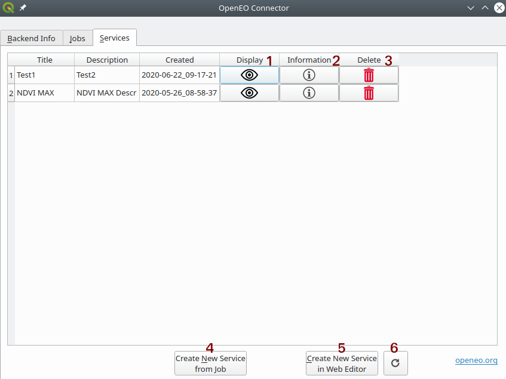

# QGIS Plugin

## Installation

There are two different versions of the QGIS Plugin available:
 
1. For getting the **latest stable version**, you can use the plugin 
manager of QGIS (Plugins -> Manage and Install Plugins). Note that you have to activate the option to show experimental 
plugins (Settings -> Show also experimental plugins). After that, you can search for 
"OpenEO", install and activate the plugin.
2. For getting the **latest version**, you can go to the official
[GitHub repository](https://github.com/Open-EO/openeo-qgis-plugin) and download the repository as a zip archive. 
Now, open the plugin manager of QGIS (Plugins -> Manage and Install Plugins) and select "Install from ZIP". 
There you can browse for the downloaded zip archive, install and activate it.   

This tutorial shows the capabilities of version 0.9. Make sure you have installed at least version 0.9 by checking it in 
the plugin manager.   

After successfully finishing the installation and activation of the plugin, there should appear the openEO logo in the 
QGIS toolbar:

Simply click on the icon to start the plugin.

## Connecting

When starting the plugin, a login dialog appears. The backend dropdown menu lists the available openEO backends from 
the [openEO Hub](https://hub.openeo.org/). By default, the plugin chooses the latest compatible version from the 
selected provider. If you want to connect to a specific version of a backend, you need to uncheck 
the checkbox labeled "Only Latest versions". It is also possible to manually type a backend url into the selection 
field, in case it is not registered at the hub yet.
 

Now that you chose your backend, you can log in with your username and password provided by the backend.
Note that the QGIS plugin only supports Basic authentication and not [OpenID Connect](https://openid.net/connect/) yet. 

If logged in successfully, the main window of the plugin appears with three tabs ("Backend Info", "Jobs", "Services"). 
The following sections will go through the capabilities of these tabs. 

## Tab1: Backend Info

The first tab shows information about the backend and the available collections and processes. 
On the top, there is a basic description about the backend you are connected to.
Next, you can choose a collection in the drop down menu to see a description of that dataset.

On the bottom, there is a drop down menu to choose one of the available processes from the backend. 
After selection, the parameters of the process are shown in the table below. The first column contains the 
parameter name. The parameter name is bold if required and otherwise optional when using the process.
Second column shows the type of the parameter and the third column a short description. 
To learn more about the process, you can click on the info button next to the drop down menu 
(marked red in the figure below). The return type of the process is written next to the info box.

## Tab2: Jobs

The "Jobs" tab lists all of your [jobs](https://openeo.org/documentation/1.0/glossary.html#data-processing-modes) 
at the backend. In openEO a job describes what the backend needs to process 
(e.g. defining a [process graph](https://openeo.org/documentation/1.0/glossary.html#processes)) as well as 
additional information. The first two columns shows the title and the date and time it got created at the backend. 
The other elements of this window are numbered at the screenshot below and described in the following list: 

1. **Status** - Shows in which lifecycle state the job is in at the moment. The first status is "created", 
if the job got just sent to the backend, but not executed yet. After the job gets executed it will be 
"queued" if the backend plans to executes it, but has not started yet. If the execution started but hasn't finished yet, 
it has the status of "running". Last but not least it will have either "canceled", if it was stopped during execution, 
"finished" if the execution was successfully or "error", if an error occurred during execution.    
2. **Execute** - By clicking on the "Play" button, the plugin will notify the backend to execute the job. 
Already finished jobs will be executed again.
3. **Display** - By clicking on the "Eye" button, the plugin downloads the resulting image of the job from the backend 
and creates a new layer in QGIS named after the title and the creation date containing the image. Note that if the result 
is not geo referenced, you might get a dialog from QGIS to choose a coordinate reference system.
4. **Adapt** - By clicking on the "Pencil" button a new dialog appears, where you can adapt the job title and 
description as well as the processes and extent of the job. How this works in detail is described in the following sections.
5. **Information** - By clicking on the "Info" button a window with additional information on the job opens up, like a 
description, a cost plan etc., if this information is provided by the backend.
6. **Delete** - By clicking on the "Trash" button the job gets deleted from the backend, after being asked if you are 
really sure to do that.
7. **Load Job from openEO Hub** - This button opens a new window with a list of shared jobs from the openEO Hub 
(see figure below). You can select one of these jobs, adapt them to your needs and create a new "duplicate" job at 
your backend. More information on that workflow can be found in the next sections.    

8. **Create new Job** - Similar to loading a job from the Hub, you can also create a job from scratch using this button. 
More information in the next sections.  
9. **Create new Job in Web Editor** - This button opens the [openEO web editor](https://editor.openeo.org/) in your 
system browser, so you can create a new job from there. This is the recommended way on creating a new job, since it has 
a graphical and therefore more convenient way of creating a job. 
10. **Refresh Table** - This button refreshes the list of jobs manually.

### Creating new Jobs

There are four ways to create a new job using this plugin, depending on whether you want to start from scratch or just 
change existing jobs:

* **From scratch with web editor** - As described in the job table overview above, there is a button (no. 9) that opens 
your web browser with the [openEO web editor](https://editor.openeo.org/). It is the recommended way to create a new job 
from scratch, since it has a very convenient graphical user interface. It also shows the process graph in a neat graph 
based manner for a better understanding of how processes are connected.
* **From scratch with QGIS** - If you are happy only using the QGIS plugin, you can create a new job using the 
button (no. 8) of the job overview dialog. It opens the job adaption window (more details in the sections below). 
In the beginning the job has already a "load_collection" process as a starting point.  
* **From openEO Hub** - If you do want to create a new job by adapting an existing one, you can choose one from the 
openEO Hub. The hub has a feature to share existing process graphs, which can be loaded by choosing it in a new pop 
up dialog. Ater selecting a job and showing the process graph, the job adaption window will pop up, where you are able 
to configure the hub job to your needs.
* **From existing Job** - Similar to loading a process graph from the openEO Hub, you can create a new job by adapting 
one of your previously created jobs at the backend. You can e.g. create a new job with a different spatial extent, or 
adding a few processes. To do so you need to click on the edit button in the job overview window (no. 4)

### Adapting existing Jobs

In this section you get an overview of the job adaption dialog and how you can create new jobs either by changing 
existing ones or by creating new ones.

1. **Job Title** - Here you can put in your title of the job, it should be a name that makes you identify the job in a 
list.
2. **Job Description** - You can describe the job in more detail in this field. 
3. **Process Graph Table** - In the process graph table you can see the list of all processes executed by the job. 
The first column contains the identifier of the process node, so a unique identifier of the process throughout the 
whole process graph (e.g. loadcollection1). Most openEO clients generate these identifiers automatically. 
In the second column you can see the name/identifier of the process (e.g. load_collection), which needs to be one of the 
processes that the backend provides. The third column shows the node identifier of the predecessor node 
In example "loadcollection1" in the second row means that the output of the node with id "loadcollection1" is the input 
of the node with id "reducedimension1".
4. **Process Edit** - When pressing on the "pencil" button, the process of the same row is loaded into the process 
table on the right (see no. 6). On this table you can adapt the arguments of the chosen process.
5. **Delete Process** - Clicking on the "trash" button deletes the selected process from the process graph. 
Note that other processes, which have this process as predecessor might fail after the deletion.
6. **Process Table** - In this table you see all arguments of the currently selected process, the expected type and 
the current value. If the name of the argument is bold, it is a required argument, hence it must be set. 
You can edit the values of the arguments directly in the text field of the value column. Some arguments have a helper 
function in the fourth column of the process table (e.g. drop down menu of all available collections in the first row)
7. **Process Argument Helper** - For some arguments of a process, the QGIS Plugin provides helper functions to make the 
adaption of the arguments easier. This is the case, every time the field of the fourth column of the process table is 
not empty.
8. **Add Process** - If you want to add a new process to the process graph you can select one with the drop down menu 
(see "Select a process") and press the button labeled "New Process". The text field on the right will be the new node id 
and it is autogenerated after selecting a process, but can also be chosen by typing something different into it. Note 
that it has to be unique within the jobs process graph, otherwise the QGIS will show an error message.
9. **Undo Changes** - Press this button if you want to undo all changes that you did on the job.  
10. **Raw Graph** - Press this button to see the raw process graph in a pop up window in JSON format. There you can also 
paste a process graph to load it into the QGIS plugin (e.g. pressing "Apply").
11. **Send Job** - Press this button if you are finished editing the job and you want to create it at the backend. 
If nothing went wrong during the job creation, it will close the adaption window and show an error message otherwise.
12. **Cancel** - Press this button to close the job adaption dialog with none of your changes taking effect.
13. **Result Process** - This checkbox needs to be checked on the last process of the process graph. It tells the 
backend that the result of the checked process is the output of the job (usually a "save_result" process). Note that 
only one process of the process graph can be checked as a result. 

#### Process Argument Helper

For some process arguments the QGIS plugin provides helper functions for more convenient editing. 
This section provides a list of all available helper functions and how to use them:

* **Collection Id** - Whenever an argument expects a collection id (e.g. "load_collection" process), the plugin shows a 
drop down menu with all available collections of the backend. There you can just select the one you want to use and it 
will be put into the arguments value.
* **Spatial Extent** - Edit buttons of arguments which expect a spatial extent (e.g. geojson, bounding-box) open a
spatial extent dialog:

On the bottom you can edit the spatial extent manually in the text box. In the drop down menu on the top you can choose 
how to select the spatial extent. You can get the extent of the current layer, the extent of a shape file, the extent of 
the current QGIS map canvas, by drawing a rectangle on the QGIS map canvas or by drawing a polygon on the QGIS map 
canvas. The drawings start after clicking on the "Draw Extent" button, so that your curser becomes a cross to draw on 
the map. After pressing the "OK" button, the extent string in the text field is set to the process argument and the 
window closes. 
* **Temporal Extent** - If an argument expects a start and end date, the edit button opens a calendar dialog:

The left calendar sets the start date and the right calendar the end date.
* **Band selection** - If an argument expects a selection of bands, the edit button opens the following dialog to choose 
from the bands available at the selected collection:

* **Process Graph Node** - If an argument expects a raster data cube, a drop down menu will appear on the edit column. 
There you can choose from existing process graph nodes (e.g. "loadcollection1") It uses the output of the given node 
identifier as input of the process argument.
* **Sub Process Graph** - Some processes need a whole (sub-)process graph as input value (e.g. apply or reduce 
processes). When clicking on the edit button, the plugin opens a new adaption window, which looks similar to the job 
adaption window, but shows the sub process graph:

In this window you can adapt the sub process graph in the same way as the original process graph. After pressing on 
"Adapt" the changes are written to the original job. Note that the sub process graph also needs to have at least one 
result process.

## Tab3: Services
The "Services" tab lists all of your [secondary web services](https://openeo.org/documentation/1.0/glossary.html#data-processing-modes) 
at the backend. In openEO a secondary service has a process graph like a job, but depending on the service type it is 
possible for the user to change the viewing extent dynamically. The first two columns shows the title, the description 
and the date and time it got created at the backend. 
The other elements of this window are numbered at the screenshot below and described in the following list: 

1. **Display** - When clicking on the "Eye", the secondary service gets loaded and creates a new layer, named afte the 
service. QGIS now loads the result of the processing into the current extent of the QGIS map canvas. Note that it will 
load the whole screen at once, so it might take a while.
2. **Information** - Clicking on the Infobox, shows some additional information about the service.
3. **Delete** - Clicking on the delete button removes the service from the backend.
4. **Refresh Table** - This button refreshes the list of services manually.

Note that with the QGIS plugin it is currently not possible to create or adapt services. 
Hence, use the [openEO web editor](https://editor.openeo.org/) for that purpose.

[//]: <> (## Example Job Adaption To Do: Create Youtube Walk-Through)

## Additional Information

* [openEO QGIS Plugin Github](https://github.com/Open-EO/openeo-qgis-plugin)
* [openEO QGIS Plugin Page](https://plugins.qgis.org/plugins/openeo-qgis-plugin-master/)