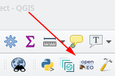
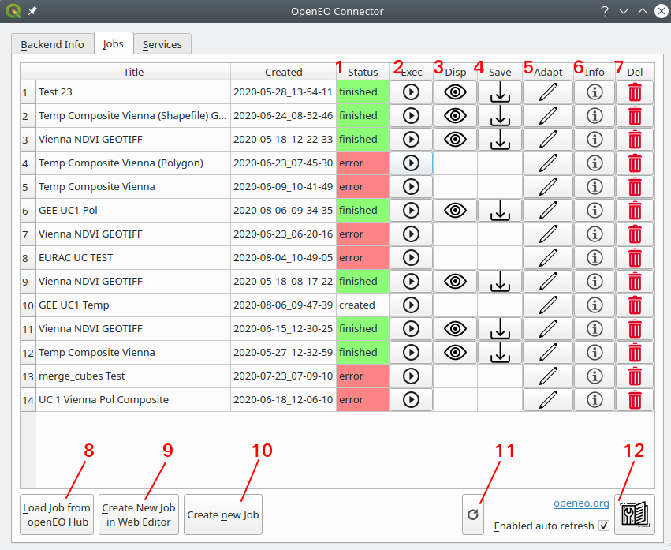
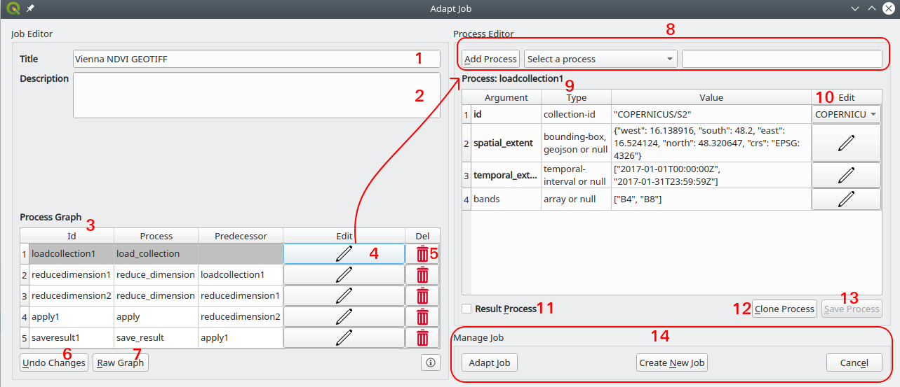
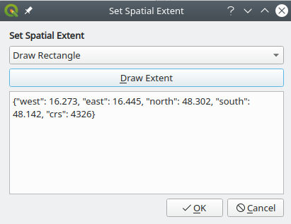
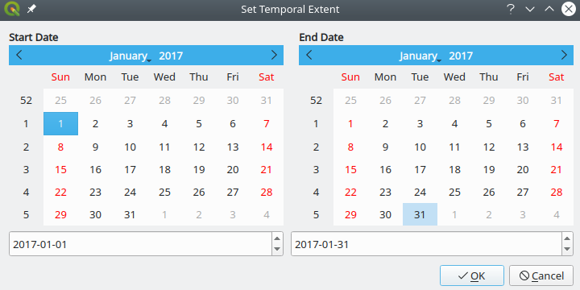
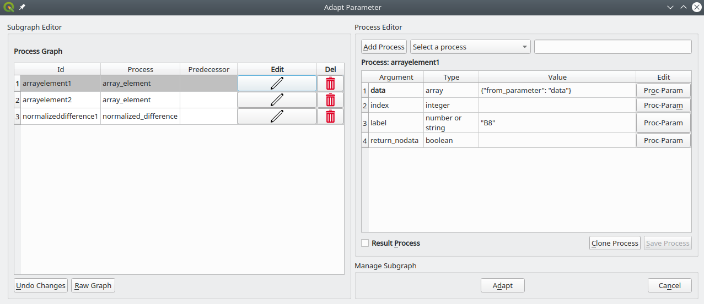
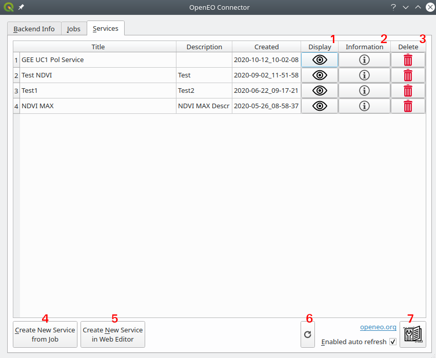
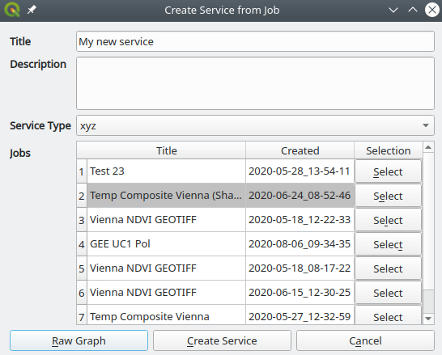

# QGIS Plugin

The openEO QGIS plugin enables exploring openEO backends as well as execute and modify your jobs at an backend 
within QGIS. The plugin can load the results of a job execution to the QGIS map, so that the user can make further 
analyses and visualisation steps. 

## Installation

There are two different versions of the QGIS Plugin available:
 
1. The **latest stable version** is accessible in the plugin 
manager of QGIS (Plugins -> Manage and Install Plugins). Note that you have to activate the option to show experimental 
plugins (Settings -> Show also experimental plugins). After that, you can search for 
"OpenEO", install and activate the plugin.
2. The **latest version** is accessible at the 
[GitHub repository](https://github.com/Open-EO/openeo-qgis-plugin). First, download the repository as zip archive. 
Now, open the plugin manager of QGIS (Plugins -> Manage and Install Plugins) and select "Install from ZIP". 
There you can browse for the downloaded zip archive, install and activate it.

This tutorial shows the capabilities of version 0.9.1. Make sure you have installed at least that version by checking in 
the plugin manager.   

After successfully installing and activating the plugin, the openEO logo should be part of the toolbar:

Simply click on the icon to start the plugin.

## Connecting

The first window you see when starting the plugin is a login dialog, since you can only access your jobs at the backend 
if you are authenticated. The backend dropdown menu contains the available openEO backends from 
the [openEO Hub](https://hub.openeo.org/). By default, the plugin chooses the latest compatible version from the 
selected provider. If you want to connect to a specific version of a backend, you need to uncheck 
the checkbox labeled "Only Latest versions". You can also manually type a backend url into the selection 
field, in case it is not registered at our hub yet.
 

Now that you have chosen a backend, you can log in with your username and password provided by the backend.
Note that the QGIS plugin only supports Basic authentication and not [OpenID Connect](https://openid.net/connect/) yet. 
Backends that do not support this authentication can not be accessed via this plugin at the moment.

If logged in successfully, the main window of the plugin appears with three tabs (**Backend Info**, **Jobs**, **Services**). 
The following sections will go through the capabilities of these tabs. 

## Tab1: Backend Info

The first tab shows information about the backend and the available collections and processes. 
On the top, there is a basic description about the backend you are connected to.
Next, you can choose a collection in the drop down menu to see a description of that dataset.

On the bottom, you can use the drop down menu to choose one of the available processes from the backend. 
After selection, the parameter of the process are listed in the table below. The first column contains the 
parameter name. The parameter name is bold if required and otherwise optional.
Second column shows the type of the parameter (e.g. raster-cube) and the third column a short description. 
To learn more about the process, you can click on the info button next to the drop down menu 
(marked red in the figure below). The return type of the process is written next to the info box. If you want to get a
good overview of all processes of openEO you might visit the 
[official processes page](https://openeo.org/documentation/1.0/processes.html), but note that not all backends 
will implement all processes listed there.

## Tab2: Jobs

The "Jobs" tab lists all of your [jobs](https://openeo.org/documentation/1.0/glossary.html#data-processing-modes) 
at the backend. In openEO a job describes what the backend needs to process 
(e.g. by defining a [process graph](https://openeo.org/documentation/1.0/glossary.html#processes)) as well as 
additional meta-information (e.g. title, creation date). The first two columns show the title and the creation date of 
the job. The other elements of the table are numbered in the screenshot and described in the following. 

1. **Status** - Shows the current lifecycle state of the job. The first status of a job is "created", 
if it got created at the backend, but not executed yet. After the job gets executed it will be 
"queued" if the backend plans to executes it, but has not started yet. If the execution started but hasn't finished yet, 
it has the status of "running". Last but not least it will have either "canceled", if it was stopped during execution, 
"finished" if the execution was successfully or "error", if an error occurred during execution.    
2. **Execute** - By clicking on the "Play" button, the plugin will start the execution of the job at the backend. 
Already finished jobs are executed again.
3. **Display** - By clicking on the "Eye" button, the plugin downloads the resulting image of the job from the backend 
and creates a new layer in QGIS named after the title and the creation date containing the image. Note that if the result 
is not geo referenced, you might get a dialog from QGIS to choose a coordinate reference system.
4. **Adapt** - By clicking on the "Pencil" button a new dialog appears, where you can adapt the job title and 
description as well as the processes and extent of the job. How this works in detail is described in the following sections.
5. **Information** - By clicking on the "Info" button a window with additional information about the job appears.
It contains information like a description, a cost plan etc., of course only if this information is provided by the backend.
6. **Delete** - By clicking on the "Trash" button the job gets deleted from the backend, after being asked if you are 
really sure about it.
7. **Load Job from openEO Hub** - This button opens a new window with a list of shared jobs (or process graphs) from the openEO Hub 
(see figure below). You can select one of these jobs, adapt them to your needs and create a new "duplicate" job at 
your backend. More information on how to do that can be found in the next sections.
    

8. **Create new Job** - Similar to loading a job from the Hub, you can also create a job from scratch using this button. 
More information in the next sections.  
9. **Create new Job in Web Editor** - This button opens the [openEO web editor](https://editor.openeo.org/) in your 
system browser, so that you can create a new job using it. This is the recommended way for creating a new job, since it has 
a graphical and therefore more convenient way of doing so. 
10. **Refresh Table** - This button refreshes the list of jobs manually.

### Creating new Jobs

There are four approaches to create a new job using this plugin, depending on whether you want to start from scratch or just 
change existing jobs:

* **From scratch with web editor** - As described in the job table overview above, there is a button (no. 9) that opens 
your web browser with the [openEO web editor](https://editor.openeo.org/). It is the recommended way to create a new job 
from scratch, since it has a very convenient graphical user interface. It also shows the process graph in a neat graph 
based manner for a better understanding of how processes are connected.
* **From scratch with QGIS** - If you want to use the QGIS plugin, you can create a new job using the 
button (no. 8) of the job overview dialog. It opens the job adaption window (more details in the section below). 
In the beginning the job has already a "load_collection" process as a starting point.  
* **From openEO Hub** - If you want to create a new job by adapting an existing one, one possibility is to choose one 
from the openEO Hub. The hub has the feature to share existing process graphs, which are listed in the pop up window, so 
that you can select one. After job selection, the job adaption window will pop up, where you are able 
to configure the hub job to your needs (see next section).
* **From existing Job** - Similar to loading a process graph from the openEO Hub, you can create a new job by adapting 
one of your existing jobs at the backend. You can e.g. create a new job with a different spatial extent, or 
adding a few processes to the original one. To do so, you need to click on the edit button in the job overview window (no. 4)

### Adapting existing Jobs

In this section you'll get an overview of the job adaption workflow using the job adaption window. 
How you get there was described in the previous section.

1. **Job Title** - Here you can write the title of the job. It is recommended to choose it in a way that 
makes you identify the job in a list more easily.
2. **Job Description** - You can describe the job in more detail in this field (e.g. what is calculated and how). 
3. **Process Graph Table** - In the process graph table you can see a list of all processes used by the job. 
The first column contains the identifier of the process node, so a unique identifier of the process throughout the 
whole process graph (e.g. loadcollection1). Most openEO clients generate these identifiers automatically. We define a 
process node (or just node) as one element of the process graph, so one executed process.  
In the second column you can see the name/identifier of the process (e.g. load_collection), which needs to be one of the 
processes that the backend provides. The third column shows the node identifier of the predecessor node. 
For example, "loadcollection1" in the second row means that the output of the node with id "loadcollection1" is the input 
of the node with id "reducedimension1".
4. **Process Edit** - When pressing on the "pencil" button, the process of the same row is loaded into the process 
table on the right (see no. 6). On this table you can adapt the arguments of the chosen process and therefore configure 
its behaviour.
5. **Delete Process** - Clicking on the "trash" button deletes the selected process from the process graph. 
Note that other processes, which have this process as predecessor might fail after the deletion.
6. **Process Table** - In this table you see all arguments of the currently selected process, the expected type and 
the current value. If the name of the argument is bold, it is a required argument, hence it must be set. 
You can edit the values of the arguments directly in the text field of the value column. For some arguments the plugin 
provides helper function in the fourth column of the process table (e.g. drop down menu of all available collections in 
the first row)
7. **Process Argument Helper** - For some arguments of a process, the QGIS Plugin provides helper functions to make the 
adaption of the arguments easier. This is the case, if the field of the fourth column in the process table is 
not empty.
8. **Add Process** - If you want to add a new process to the process graph you can select one with the drop down menu 
(see "Select a process") and press the button labeled "Add Process". The text field on the right will be the new node id 
and it is autogenerated after selecting a process, but can also be manually defined by typing it into the text field. Note 
that it has to be unique within the job, otherwise the plugin shows an error message.
9. **Undo Changes** - Press this button if you want to undo all changes that you did on the job.  
10. **Raw Graph** - Press this button to see the raw process graph (JSON format) in a pop up window. Changes to the 
process graph are also applied if you click "Apply". Therefore, you can also copy and paste here a complete process graph  
into the QGIS plugin.
11. **Send Job** - Press this button if you are finished editing the job and you want to create it at the backend. 
If nothing went wrong during the job creation, it will close the adaption window, otherwise it shows an error message.
12. **Cancel** - Press this button to close the job adaption dialog with none of your changes taking effect.
13. **Result Process** - This checkbox needs to be checked on the last process of the process graph. It tells the 
backend that the result of the checked process is the output of the job (usually a "save_result" process). Note that 
only one process of the process graph can be a result node. 
14. **Clone Process** - When clicking on this button, a clone of the currently selected node gets created and loaded 
into the process table on the right. Note that clicking on this button does not add it to the job already, so you need to 
press on the "Add Process" button to do so.
15. **Save Changes** - Changes on the process arguments are not stored in the process graph until this button is pressed.
You can see if there are unsaved changes if this button is enabled (see screenshot "Clone Process" button), otherwise it 
is disabled (see screenshot). 
#### Process Argument Helper

For some process arguments the QGIS plugin provides helper functions for a more convenient editing. 
This section provides a list of the available helper functions and how to use them:

* **Collection Id** - Whenever an argument expects a collection id (e.g. "load_collection" process), the plugin shows a 
drop down menu with all available collections of the backend. There you can select one and it will be put into the 
arguments value.
* **Spatial Extent** - Edit buttons of arguments which expect a spatial extent (e.g. geojson, bounding-box) open a
spatial extent dialog:

On the bottom you can edit the spatial extent manually in the text box. In the drop down menu on the top you can choose 
how to select the spatial extent. You can get the extent of the current layer, the extent of a shape file, the extent of 
the current QGIS map canvas, by drawing a rectangle on the QGIS map canvas or by drawing a polygon on the QGIS map 
canvas. The drawings start after clicking on the "Draw Extent" button, so that your curser becomes a cross to draw on 
the map. After pressing the "OK" button, the extent string in the text field is set to the process argument and the 
window closes. 
* **Temporal Extent** - If an argument expects a start and end date, the edit button opens a calendar dialog:

The left calendar sets the start date and the right calendar the end date.
* **Band selection** - If an argument expects a selection of bands, the edit button opens the following dialog to choose 
from the bands available at the selected collection. Note that it always lists all bands of the collection even if some 
bands are filtered by previous processes and therefore not available in the datacube anymore. 

* **Process Graph Node** - If an argument expects a raster data cube, a drop down menu will appear on the edit column. 
There you can choose from existing process graph nodes (e.g. "loadcollection1") It uses the output of the given node 
identifier as input of the process argument.
* **Sub Process Graph** - Some processes need a whole (sub-)process graph as input value (e.g. apply or reduce 
processes). When clicking on the edit button, the plugin opens a new adaption window, which looks similar to the job 
adaption window, but shows the sub process graph:

In this window you can adapt the sub process graph in the same way as the original process graph. After pressing on 
"Adapt", the changes are written to the original job. Process arguments, which do not have special editing fields,
have a "Proc-Param" button. If pressed it will forward the input data of the parent node 
(so the one with the subgraph as attribute) to the selected argument (see screenshot "data" argument). Note that the 
sub process graph also needs to have at least one result node.

## Tab3: Services
The "Services" tab lists all of your [secondary web services](https://openeo.org/documentation/1.0/glossary.html#data-processing-modes) 
at the backend. In openEO a secondary service has a process graph like a job, but depending on the service type it is 
possible for the user to change the viewing extent dynamically. The first two columns shows the title, the description 
and the date and time it got created at the backend. 
The other elements of this window are numbered at the screenshot below and described in the following. 

1. **Display** - When clicking on the "Eye", the secondary service gets loaded into a new QGIS layer, named after the 
service. QGIS now fetches the result of the processing into the current extent of the QGIS map canvas. Note that it will 
load the whole screen at once, so it might take a while.
2. **Information** - Clicking on the Infobox, shows detailed information about the service.
3. **Delete** - Clicking on the delete button removes the service from the backend.
4. **Create from job** - By clicking on this button you can create a new service from one of your jobs. It will create a 
service with the same process graph as the selected job, but the extent will be dynamically loaded via the service. By 
clicking on the button a new dialog pops up:

On the creation dialog you can set a title and a description text, but they are optional. But, you have to select a job and 
choose a type of secondary service. The drop down menu of the service types contains only the ones supported by your 
backend. By clicking on "Create Service" the plugin creates the service on the backend, so you should be able to see it 
on the table. Not that the list of jobs contains only successfully executed jobs (e.g. with "finished" status). 
5. **Create from web editor** - Similarly to the job table overview, this button opens your web browser with 
the [openEO web editor](https://editor.openeo.org/). There you can create new services via the editor or from your jobs.
6. **Refresh Table** - This button refreshes the list of services manually.

[//]: <> (## Example Job Adaption To Do: Create Youtube Walk-Through)

## Additional Information

* [openEO QGIS Plugin Github](https://github.com/Open-EO/openeo-qgis-plugin)
* [openEO QGIS Plugin Page](https://plugins.qgis.org/plugins/openeo-qgis-plugin-master/)