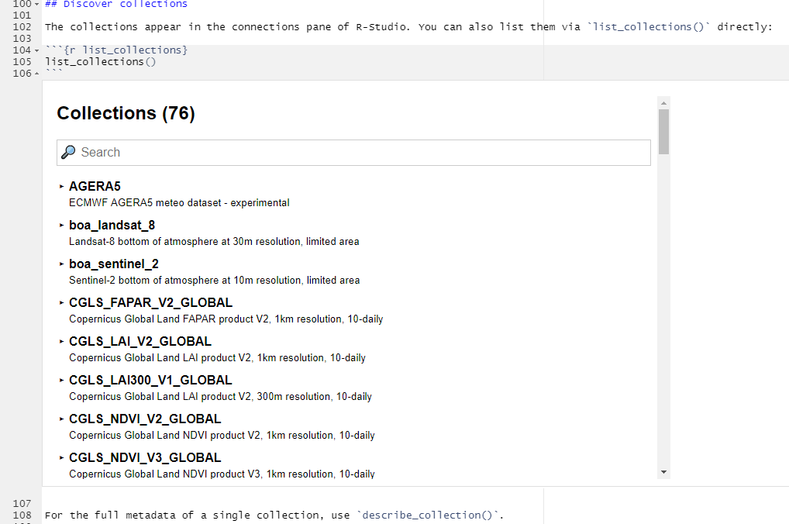

Today, we released a new version 1.2.0 of the openEO R Client, which features a couple of [improvements and bug fixes](https://github.com/Open-EO/openeo-r-client/releases/tag/v1.2.0).

You can get it through CRAN: [openeo](https://cran.r-project.org/package=openeo)
This means you can  install or update the R client with the following command:

```r
install.packages("openeo")
```

If you have trouble installing or working with the package, feel free to leave an issue in the [GitHub issue tracker](https://github.com/Open-EO/openeo-r-client/issues).

We would like to highlight some of the changes:

* `get_sample`: We've introduced a method to retrieve sample data that can be used to experiment with a small subset of the data locally. A vignette shows how to use it: [Sample Data Retrieval](https://cran.r-project.org/web/packages/openeo/vignettes/sample_data.html)
* Many functions such as `list_collections` , `describe_collection`, `list_processes` now return visual components in environments that support it (Jupyter, RMarkdown, knitr). Here's an example of the collection list, which includes searching capabilities:

* The metadata filter in `load_collection` was made much easier to use. **You may need to adapt your code!**
  The new method to filter by cloud cover looks very clean and is less cumbersome to write. It is as simple as this: `properties = list("eo:cloud_cover" = function(x) x <= 50)`
  Beforehand, the same filter had to be specified as such: 
  
  ```r
  properties = list(
        "eo:cloud_cover" = list(
            "process_graph" = list(
                "cc" = list(
                    "process_id" = "lte"
                    , "arguments" = list(
                        "x" = list("from_parameter" = "value")
                        , "y" = p
                    )
                    , "result" = TRUE
                )
            )
        )
    )
  ```
* The login procedure was greatly simplified for back-ends that support this new behavior. For example, on openEO Platform you can now login simply by calling the login method as such `login()` instead of passing a client ID and secret tom `connect()` or `login()`. It is still possible, but not required any more. It will then interactively guide you through the login procedure. It is now also supported to login in environments that are remotely hosted (e.g. RStudio Cloud, Jupyter). 
* Getting the JSON representation of a process is now simplified. The new recommended way is `toJSON(as(result, "Process"))` where `result` is the last node of your process, which usually is `save_result`.
* Directly load data into [`stars`](https://r-spatial.github.io/stars/) if you set `as_stars=TRUE` in `compute_result`

