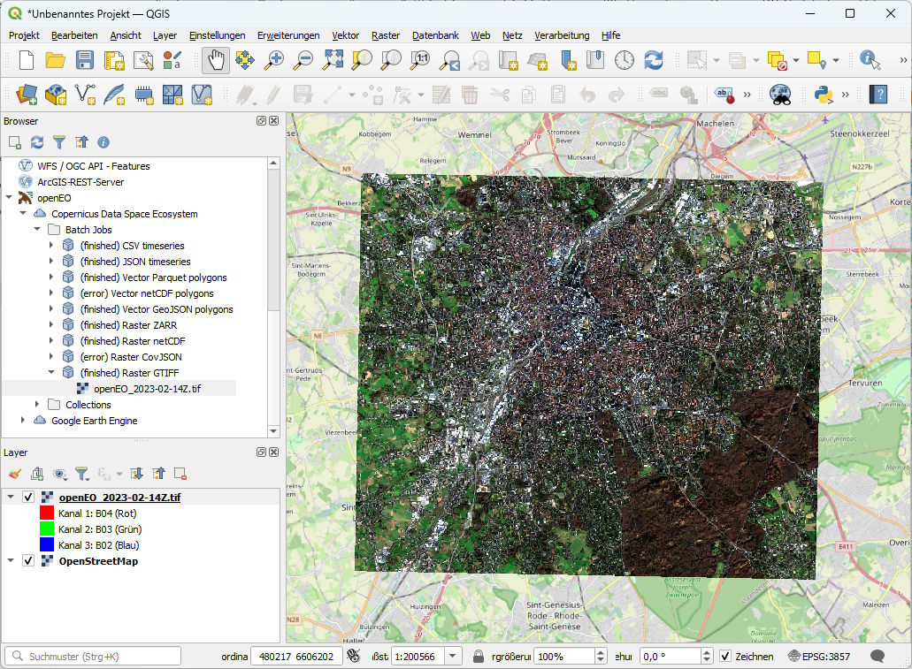

We’re excited to announce the availability of a **new and fully rewritten openEO QGIS plugin**, now ready for broader testing by the community.

This release represents a major step forward in usability, stability, and feature coverage. The plugin has been redesigned from the ground up and is now **fully integrated into the QGIS Browser**, providing a seamless and intuitive way to access openEO backends and resources directly from QGIS.

- **QGIS plugin repository:**  
  <https://plugins.qgis.org/plugins/openeo_plugin/>

- **Updated documentation & setup instructions:**  
  <https://openeo.org/documentation/1.0/qgis/>

The plugin requires **QGIS 3.40.0 or later** and is expected to be compatible with the upcoming **QGIS 4.0**. It can be downloaded from within QGIS, just search for 'openEO' in the plugin manager.

## What’s New

The rewritten plugin introduces a wide range of new features and improvements:

- **Deep QGIS integration**
  - Fully integrated into the **QGIS Browser** for easy access

- **Broad API & backend support**
  - Support for **all openEO API 1.x versions**
  - **openEO Hub** integration

- **Improved authentication**
  - Support for **OpenID Connect** and **HTTP Basic authentication**
  - Generally improved and more robust authentication handling, including multi account support

- **Explore and manage openEO resources**
  - Browse **Collections**, **batch jobs**, and **web services**
  - Allows for pagination and sorting

- **Rich visualization capabilities**
  - Visualize batch job results:
    - GeoTIFF  
    - netCDF (raster only)  
    - GeoJSON  
    - GeoParquet
  - Visualize web services:
    - XYZ  
    - WMTS
  - Preview collections when supported by the backend (XYZ, WMTS)

- **STAC integration**
  - Copy **STAC metadata URLs** and **STAC asset URLs** to easily load other assets via the QGIS layer manager (e.g. CSV) or the QGIS STAC integration (e.g. STAC Items for STAC Collections)

- **Easy data download**
  - Download assets **all at once** or **individually**

## Call for Testing & Feedback

We consider the current version **stable and ready to be tested by a broader user audience**. Over the coming weeks, we will collect feedback and apply final refinements, with a **final release planned for the end of January or early February**. We also plan to present the QGIS plugin in one of the next openEO community meeting, please keep an eye on the [planned topics](https://openeo.org/meetings.html).

**Your feedback is highly appreciated!**  
Please share issues, suggestions, or improvements via [**GitHub issues**](https://github.com/Open-EO/openeo-qgis-plugin/issues).

## Acknowledgements

The revival and complete reshaping of the openEO QGIS plugin was driven by **Caro Niebl**, an intern at [moreGeo](https://moregeo.it), who has dedicated the past weeks to rethinking and rebuilding the plugin from the ground up.

This work was funded to a large extent by [VITO](https://vito.be). We would like to sincerely thank them for their support and contribution to the openEO ecosystem.

## This and Next Year

It has been a great year for openEO. CDSE is making openEO available to a large number of users, and more projects are adopting openEO with more launches expected next year.

We are looking forward to next year, expecting new releases of the openEO API and openEO processes, and hopefully an adoption as OGC community standard.

🎄 **Merry Christmas and a Happy New Year to the openEO community!**
