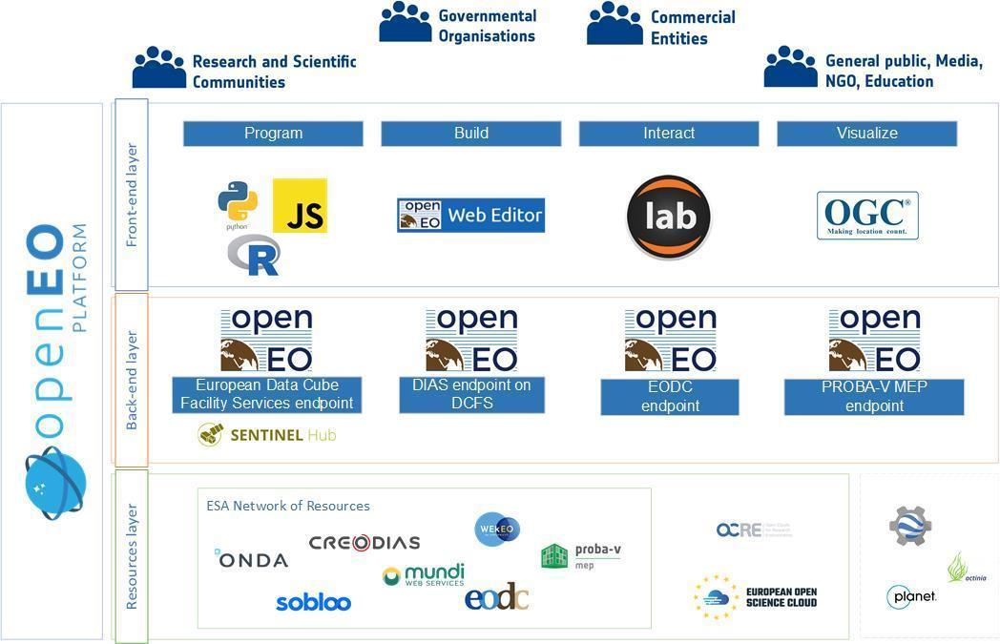

openEO Platform is a new project built on top of openEO.
It brings openEO to production and offers data access and data processing services to the the EO community.
The project is funded by [ESA](https://esa.int) and starts in September 2020. The consortium working on this project consists of [EODC](https://eodc.eu/) (lead), [EGI](https://www.egi.eu/), [EURAC](http://www.eurac.edu/), [GEO](http://www.earthobservations.org/index.php), [Sinergise](https://www.sinergise.com/), [VITO](https://vito.be/en) and [WWU Münster](https://ifgi.de).

## About

openEO Platform builds upon the EO cloud processing platforms managed by VITO, Sinergise and EODC, and the platform management and software development experience of all partners. openEO platform unites:

1. the Proba-V exploitation platform, one of the first EO-focused private clouds in Europe,
2. Sentinel Hub, the most advanced on-the-fly satellite data processing engine handling more than one hundred million requests every month, and its future evolution,
3. Data Cube Facility Services, and 
4. EODCs cloud infrastructure and HPC experience,

integrating all of these with the openEO API, a community project that started with H2020 funding and that comes with an ecosystem of user-friendly, graphical and command-line based clients. The openEO API’s original goal of fostering the current heterogeneity in interfaces of cloud-based EO processing back-ends matches the ESA requirement of realizing a federated infrastructure and matches the current situation that no single processing back-end serves (or will any time soon serve) all datasets of interest.

openEO Platform will serve different user groups by providing clients and interfaces tailored to their needs: remote sensing researchers can make use of a front-end where JupyterLab is being proposed as its main data science front-end. R users can make use of the openEO R client and develop workflows in RStudio using R-Markdown. Users accustomed to building workflows interactively can use the openEO web client for graphically creating workflows, exploring results, and managing jobs. Software developers can work in their own programming IDE to integrate services into larger or dedicated applications. All interfaces share the openEO client-side libraries to minimize complexity. These libraries are already available for Python, R and JavaScript, and significantly reduce the learning curve for using these services. For well-known services such as viewing, OGC services are exposed to ensure interoperability with other, existing tools. The successful open development model adopted by openEO will be continued while developing openEO Platform, in order to make it an inclusive community project. The figure below shows a high-level conceptual overview of the different building blocks.

An idea that is unique to OpenEO is the combined facility of predefined and user-defined functions. This ‘best of both worlds’ approach allows optimization of everyday tasks by the backend provider, while still giving the user access to the set of libraries and tools that reflect years of work by the earth observation and open source community such as TensorFlow, Keras, GDAL, SNAP and OpenCV. Using such ‘user defined functions’ will not require a complex process but will be as simple as writing local code.

To scale up the processing function and workflow library available in OpenEO, as well as available examples and documentation, we want to engage the users to share their work and participate in the community. This can be done in the ‘classical’ way, by providing open source code, documentation or simply being an active forum member, or by providing their work on a marketplace, where a researcher or company can actually be rewarded for making a workflow, product or service available.

Machine learning (ML) and artificial intelligence (AI) are key technologies enabled by the platform. These data-hungry algorithms rely on combining earth observation raster data together with other datasets in various formats, which will be supported by flexible data access mechanisms. The platform will support integrated ML algorithms for ease-of-use, external libraries such as Tensorflow for flexibility, and export for use in external AI services to build a truly federated ecosystem. Data Cube service will be upgraded to serve as a distribution mean for various derived products, not just for visualization but also for ad-hoc analysis of the results.

The overall concept of openEO Platform was designed for sustainability, which is best assured by

1. having low costs of operation and
2. building upon existing and operational services with their own user base and revenues attached to it. 

The vast majority of operational costs, with the exception of a small number of virtual machines, will be directly tied to users running their processes, and paying for it. Well established IT design principles based on docker containers are used to ensure scalability of the system and shutting them down when not in use, releasing them back if requested.

The openEO platform service will initially offer three different revenue models:

1. an openEO platform Start-package offered via a flat-rate based billing model; and 
2. an openEO platform Developer-package provides a pay per use system based on unit costs per service item, and
3. an openEO custom-package provides an offer based on estimated effort and resources required, including individual support.

Free trial versions will be provided in order to support the user uptake.

*More information will be published in the next weeks.*

